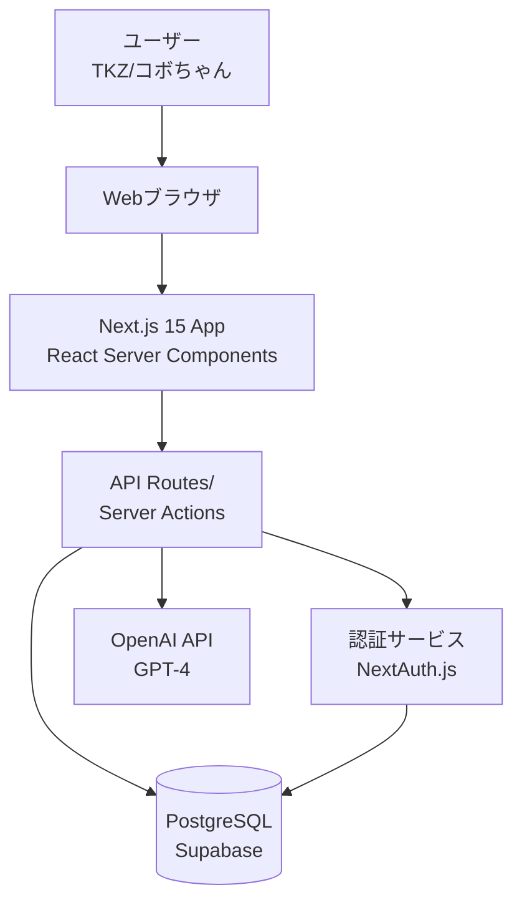
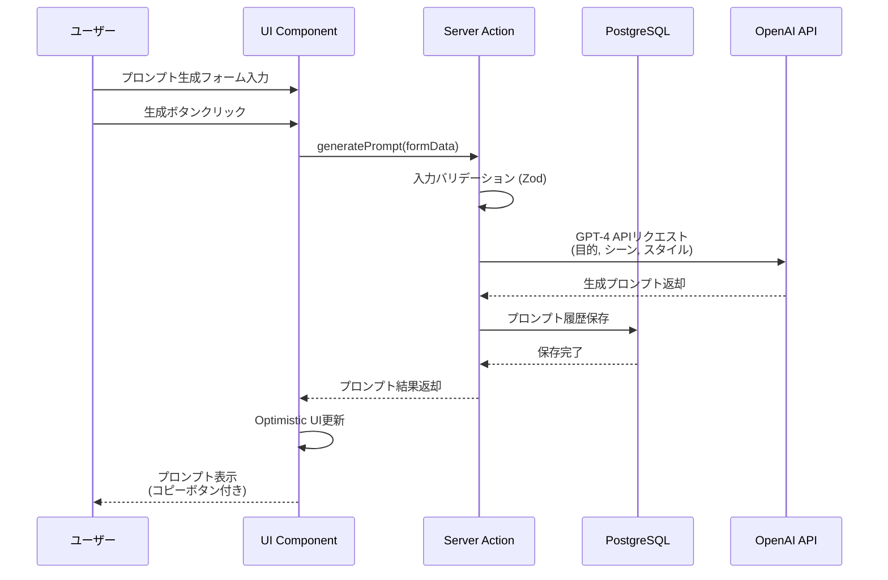
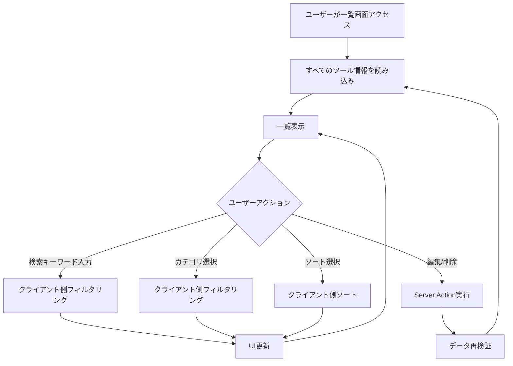
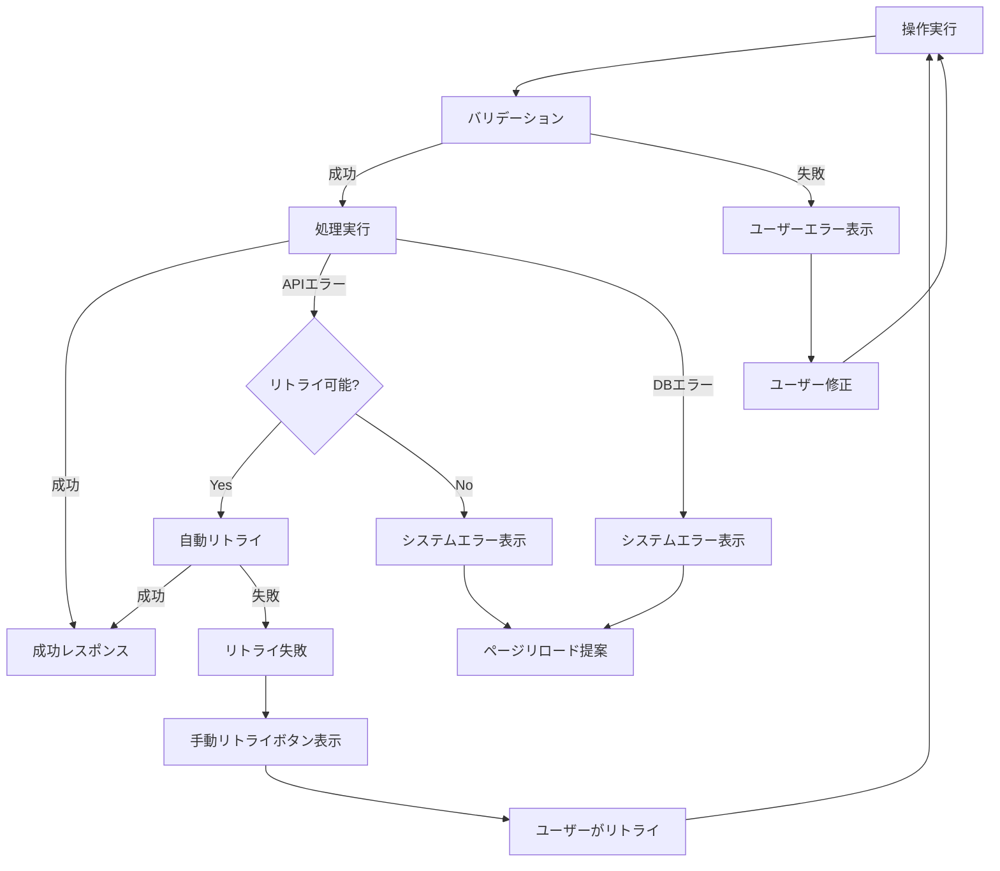

# 技術設計ドキュメント

## Overview

本アプリケーションは、TKZとコボちゃんの2名が使用する、AIツールの知見共有とSora2動画生成プロンプトの自動作成を実現するMVPです。過去に使用したAIソフトやサービスの情報を蓄積・共有し、その知見を活用してSora2での動画生成を効率化します。フルスタックWebアプリケーションとして、レスポンシブなUIと高速な開発・デプロイを実現し、ワクワクするユーザー体験を提供します。

### Goals

- 2週間以内のMVP開発と初回デプロイ実現
- 2名のユーザーが快適に使える高速レスポンスUIの提供
- AIツール情報とプロンプト履歴の確実な永続化と共有
- OpenAI GPT-4を活用した高品質なSora2プロンプト自動生成
- モバイルとPCの両方で快適に動作するレスポンシブデザイン

### Non-Goals

- 3名以上のユーザー登録機能（将来的な拡張として考慮）
- リアルタイムコラボレーション機能（同時編集は不要）
- 動画ファイルのアップロードや保存機能（プロンプトのみを扱う）
- マルチテナント対応（シングルテナント前提）
- Sora APIとの直接統合（プロンプト生成のみに集中）

## Architecture

### High-Level Architecture



### Technology Stack and Design Decisions

#### Frontend Layer
- **選定**: Next.js 15 App Router with React 18
- **根拠**:
  - フルスタックフレームワークによりフロントエンドとバックエンドを統合的に開発可能
  - React Server Componentsにより初期ロード時間を最小化
  - ファイルベースルーティングで直感的な開発体験
- **代替案**:
  - Remix: 優れたデータローディングだが、Next.jsほどのエコシステムがない
  - SvelteKit: 高速だがエコシステムとコミュニティがNext.jsより小さい
- **トレードオフ**: Next.jsの学習コストはあるが、MVP開発速度とスケーラビリティで優位

#### UI/Styling
- **選定**: Tailwind CSS v4 + shadcn/ui
- **根拠**:
  - Utility-firstアプローチで高速なUI開発
  - shadcn/uiで再利用可能な高品質コンポーネントを即座に利用
  - デザインシステムの一貫性を自動的に保証
- **代替案**:
  - CSS Modules: より柔軟だがコンポーネント開発速度が遅い
  - Styled Components: ランタイムコストが発生
- **トレードオフ**: カスタムデザインの自由度はやや低いが、MVP速度とメンテナンス性で優位

#### Backend/API Layer
- **選定**: Next.js Server Actions + API Routes
- **根拠**:
  - Server Actionsでフォーム処理とミューテーションを簡潔に実装
  - API RoutesでRESTful APIを提供し外部統合の余地を残す
  - TypeScriptの型安全性をフロントエンドからバックエンドまで一貫して適用
- **代替案**:
  - Express.js: 別サーバーの管理が必要でデプロイが複雑化
  - tRPC: 優れた型安全性だがNext.js Server Actionsで十分
- **トレードオフ**: Next.js依存度が高まるが、開発速度と型安全性で大幅に優位

#### Database
- **選定**: PostgreSQL (Supabase)
- **根拠**:
  - リレーショナルデータベースでデータ整合性を保証
  - Supabaseで認証、ストレージ、リアルタイム機能を統合提供
  - Vercelとのシームレスな統合
  - 無料枠で十分な容量（500MB、100,000行まで）
- **代替案**:
  - SQLite + Turso: よりシンプルだがスケーラビリティに制限
  - MongoDB: スキーマレスの柔軟性は不要
- **トレードオフ**: 外部サービス依存だが、インフラ管理の手間を削減し開発に集中可能

#### Authentication
- **選定**: NextAuth.js v5 (Auth.js)
- **根拠**:
  - Next.js 15 App Routerとのネイティブ統合
  - Credentials Providerで独自のユーザー名/パスワード認証を実装
  - セッション管理とCSRF保護を自動提供
- **代替案**:
  - Supabase Auth: より簡単だが、カスタマイズ性がやや低い
  - 自前実装: セキュリティリスクが高くメンテナンスコスト大
- **トレードオフ**: 設定の複雑さはあるが、セキュリティと柔軟性を確保

#### AI Service
- **選定**: OpenAI GPT-4 API
- **根拠**:
  - 最先端のLLMで高品質なプロンプト生成を実現
  - 豊富なドキュメントとコミュニティサポート
  - Sora（OpenAI製品）向けプロンプト生成に最適
- **代替案**:
  - Claude API: 高品質だがOpenAIより新しくSoraとの親和性が未知数
  - Gemini API: 競争力はあるがエコシステムが小さい
- **トレードオフ**: API利用コストが発生するが、品質と信頼性を優先

#### Deployment & Hosting
- **選定**: Vercel
- **根拠**:
  - Next.jsとのネイティブ統合で最高のパフォーマンス
  - GitベースのCI/CDで自動デプロイ
  - Edge Networkでグローバルに高速アクセス
  - 無料枠で十分なリソース
- **代替案**:
  - AWS Amplify: より柔軟だが設定が複雑
  - Railway/Render: シンプルだがNext.js最適化が弱い
- **トレードオフ**: Vercel依存だが、デプロイ体験とパフォーマンスで圧倒的優位

#### Key Design Decisions

**Decision 1: React Server Components (RSC) の積極活用**
- **Context**: データフェッチングとレンダリングのパフォーマンス最適化が必要
- **Alternatives**:
  - Client-side fetching (useEffect): 従来の方法だがネットワークウォーターフォール発生
  - getServerSideProps: Page Routerの方法でApp Routerでは非推奨
- **Selected Approach**: Server Componentsでデータ取得し、必要な部分のみClient Components化
- **Rationale**:
  - 初期ロード時のJavaScriptバンドルサイズを最小化
  - サーバー側でデータベースやAPIに直接アクセスし、高速レスポンス
  - SEOフレンドリーなSSR（Server-Side Rendering）を自動実現
- **Trade-offs**:
  - 得るもの: パフォーマンス向上、SEO改善、開発体験向上
  - 失うもの: クライアント側の即時インタラクティビティ（必要な箇所のみClient Componentで補完）

**Decision 2: Server ActionsによるミューテーションとForm処理**
- **Context**: データ更新処理（AIツール登録、プロンプト生成など）の実装方法
- **Alternatives**:
  - API Routes + fetch: 従来のRESTful APIアプローチ
  - GraphQL Mutations: 型安全だが追加の学習コストとセットアップ
- **Selected Approach**: Next.js Server Actionsを主要なミューテーション処理に使用
- **Rationale**:
  - フォームからサーバーサイド処理まで一貫したTypeScript型定義
  - プログレッシブエンハンスメント（JavaScriptなしでも動作）
  - ボイラープレートコードを大幅削減
- **Trade-offs**:
  - 得るもの: 開発速度向上、型安全性、シンプルなコード
  - 失うもの: REST APIとしての汎用性（必要に応じてAPI Routesも併用）

**Decision 3: Optimistic UIパターンの採用**
- **Context**: AIツール登録やプロンプト保存時のUX改善
- **Alternatives**:
  - 同期的な処理待ち: シンプルだがUXが悪い
  - ローディングスピナーのみ: 改善されるが待機感が残る
- **Selected Approach**: useOptimistic hookを活用し、楽観的UI更新を実装
- **Rationale**:
  - ユーザーアクションに対する即座のフィードバック
  - 体感速度を大幅に向上しワクワク感を演出
  - エラー時のロールバックも自動処理
- **Trade-offs**:
  - 得るもの: 優れたUX、体感速度の向上
  - 失うもの: やや複雑なエラーハンドリングロジック（ライブラリで緩和）

## System Flows

### Sequence Diagram: Sora2プロンプト生成フロー



### Process Flow: AIツール情報の検索・フィルタリング



## Requirements Traceability

| 要件 | 要件概要 | コンポーネント | インターフェース | フロー |
|------|---------|--------------|--------------|-------|
| 1.1-1.6 | AIツール情報の登録・管理 | ToolManagementService, ToolRepository | createTool(), updateTool(), deleteTool() | CRUD基本フロー |
| 2.1-2.5 | AIツール情報の検索・フィルタリング | ToolListComponent, SearchService | searchTools(), filterByCategory() | 検索・フィルタリングフロー |
| 3.1-3.6 | Sora2プロンプト自動生成 | PromptGenerationService, OpenAIClient | generatePrompt(), regeneratePrompt() | プロンプト生成フロー |
| 4.1-4.6 | プロンプト生成履歴の管理 | PromptHistoryService, PromptRepository | savePrompt(), getPromptHistory() | 履歴管理フロー |
| 5.1-5.6 | ユーザー認証とアクセス制御 | AuthService, SessionManager | signIn(), signOut(), validateSession() | 認証フロー |
| 6.1-6.5 | データの共有と同期 | SharedDataService, UserContext | shareData(), getUserData() | データ共有フロー |
| 7.1-7.5 | UI使いやすさ | ResponsiveLayout, FeedbackSystem | - | UI/UXパターン |

## Components and Interfaces

### Presentation Layer

#### ToolListPage
**Responsibility & Boundaries**
- **Primary Responsibility**: AIツール一覧の表示と検索・フィルタリングUIの提供
- **Domain Boundary**: プレゼンテーション層（UI）
- **Data Ownership**: クライアント側の表示状態（検索キーワード、フィルタ選択）
- **Transaction Boundary**: なし（読み取り専用）

**Dependencies**
- **Inbound**: ユーザーの直接アクセス
- **Outbound**: ToolManagementService（データ取得）、SearchService（検索・フィルタリング）
- **External**: shadcn/ui（UIコンポーネント）

**Contract Definition**

Server Component（データフェッチング）:
```typescript
interface ToolListPageProps {
  searchParams: { query?: string; category?: string };
}

async function ToolListPage({ searchParams }: ToolListPageProps): Promise<JSX.Element>
```

Client Component（インタラクティブ機能）:
```typescript
interface ToolListClientProps {
  initialTools: AITool[];
}

function ToolListClient({ initialTools }: ToolListClientProps): JSX.Element
```

#### PromptGeneratorPage
**Responsibility & Boundaries**
- **Primary Responsibility**: Sora2プロンプト生成フォームと結果表示
- **Domain Boundary**: プレゼンテーション層（UI）
- **Data Ownership**: フォーム入力状態、生成結果表示状態
- **Transaction Boundary**: なし（Server Actionに委譲）

**Dependencies**
- **Inbound**: ユーザーの直接アクセス
- **Outbound**: PromptGenerationService（プロンプト生成）
- **External**: shadcn/ui、react-hook-form、zod

**Contract Definition**

```typescript
interface PromptGeneratorPageProps {}

function PromptGeneratorPage(props: PromptGeneratorPageProps): JSX.Element

interface PromptFormData {
  purpose: string; // 動画の目的
  sceneDescription: string; // シーン説明
  style?: string; // スタイル
  duration?: string; // 長さ
  additionalRequests?: string; // その他要望
}
```

### Application Layer

#### ToolManagementService
**Responsibility & Boundaries**
- **Primary Responsibility**: AIツール情報のCRUD操作を統括
- **Domain Boundary**: アプリケーション層（ビジネスロジック）
- **Data Ownership**: なし（リポジトリに委譲）
- **Transaction Boundary**: 単一ツール操作

**Dependencies**
- **Inbound**: Server Actions、API Routes
- **Outbound**: ToolRepository（データ永続化）
- **External**: zod（バリデーション）

**Contract Definition**

```typescript
interface ToolManagementService {
  createTool(data: CreateToolInput, userId: string): Promise<Result<AITool, ToolError>>;
  updateTool(id: string, data: UpdateToolInput, userId: string): Promise<Result<AITool, ToolError>>;
  deleteTool(id: string, userId: string): Promise<Result<void, ToolError>>;
  getToolById(id: string): Promise<Result<AITool, ToolError>>;
  getAllTools(): Promise<Result<AITool[], ToolError>>;
}

type CreateToolInput = {
  name: string;
  category: string;
  purpose?: string;
  impression?: string;
  rating?: number;
  usedAt?: Date;
};

type UpdateToolInput = Partial<CreateToolInput>;

type ToolError =
  | { type: 'NOT_FOUND'; message: string }
  | { type: 'VALIDATION_ERROR'; message: string; errors: ZodError }
  | { type: 'PERMISSION_DENIED'; message: string }
  | { type: 'DATABASE_ERROR'; message: string };
```

**Preconditions**:
- ユーザーは認証済み
- createTool: name, categoryは必須
- updateTool, deleteTool: toolIdは存在するレコード

**Postconditions**:
- createTool: 新規レコードがDBに保存され、AIToolオブジェクトが返される
- updateTool: 指定レコードが更新される
- deleteTool: 指定レコードが削除される

**Invariants**:
- すべてのツール情報はユーザーIDと紐付けられる
- 削除は論理削除（deletedAtフラグ）

#### PromptGenerationService
**Responsibility & Boundaries**
- **Primary Responsibility**: OpenAI APIを使用したSora2プロンプトの生成
- **Domain Boundary**: アプリケーション層（AIサービス統合）
- **Data Ownership**: なし（外部API結果を中継）
- **Transaction Boundary**: プロンプト生成と履歴保存を含むトランザクション

**Dependencies**
- **Inbound**: Server Actions
- **Outbound**: OpenAIClient（外部API）、PromptRepository（履歴保存）
- **External**: openai SDK

**External Dependencies Investigation**

**OpenAI API調査結果**:
- **公式ドキュメント**: https://platform.openai.com/docs/api-reference
- **モデル選択**: GPT-4 Turbo (`gpt-4-turbo-preview`) - コスト効率と品質のバランス
- **認証方法**: APIキーをAuthorizationヘッダーに設定 (`Bearer YOUR_API_KEY`)
- **レート制限**: Tier 1（無料アカウント）で 3 RPM、40000 TPM（Tokens Per Minute）
- **料金**: $0.01 / 1K prompt tokens, $0.03 / 1K completion tokens
- **エラーハンドリング**:
  - 429 (Rate limit exceeded): エクスポネンシャルバックオフで再試行
  - 401 (Invalid API key): ユーザーエラーとして扱い、設定確認を促す
  - 500 (Server error): 一時的なエラーとして再試行
- **ベストプラクティス**:
  - System promptで役割を明確化（"You are an expert in creating video generation prompts for Sora"）
  - Few-shot examplesで出力フォーマットを誘導
  - temperature=0.7でクリエイティブさと一貫性のバランスを取る

**Contract Definition**

```typescript
interface PromptGenerationService {
  generatePrompt(input: PromptGenerationInput, userId: string): Promise<Result<GeneratedPrompt, PromptError>>;
  regeneratePrompt(promptId: string, userId: string): Promise<Result<GeneratedPrompt, PromptError>>;
}

type PromptGenerationInput = {
  purpose: string;
  sceneDescription: string;
  style?: string;
  duration?: string;
  additionalRequests?: string;
};

type GeneratedPrompt = {
  id: string;
  promptText: string;
  inputParameters: PromptGenerationInput;
  model: string; // 使用したGPTモデル
  createdAt: Date;
  userId: string;
};

type PromptError =
  | { type: 'API_ERROR'; message: string; statusCode?: number }
  | { type: 'RATE_LIMIT_EXCEEDED'; message: string; retryAfter?: number }
  | { type: 'INVALID_INPUT'; message: string; errors: ZodError }
  | { type: 'DATABASE_ERROR'; message: string };
```

**Preconditions**:
- APIキーが環境変数に設定されている
- purpose, sceneDescriptionは必須入力

**Postconditions**:
- 生成されたプロンプトがDBに保存される
- ユーザーに生成結果が返される

**Invariants**:
- プロンプト生成履歴は削除不可（監査のため）
- すべての履歴はユーザーIDと紐付けられる

#### AuthService
**Responsibility & Boundaries**
- **Primary Responsibility**: ユーザー認証とセッション管理
- **Domain Boundary**: アプリケーション層（セキュリティ）
- **Data Ownership**: セッショントークン
- **Transaction Boundary**: 認証操作

**Dependencies**
- **Inbound**: Server Actions、Middleware
- **Outbound**: UserRepository（ユーザー情報検証）
- **External**: NextAuth.js、bcrypt

**Contract Definition**

```typescript
interface AuthService {
  signIn(credentials: SignInCredentials): Promise<Result<SessionUser, AuthError>>;
  signOut(sessionToken: string): Promise<Result<void, AuthError>>;
  validateSession(sessionToken: string): Promise<Result<SessionUser, AuthError>>;
  hashPassword(password: string): Promise<string>;
  verifyPassword(password: string, hash: string): Promise<boolean>;
}

type SignInCredentials = {
  username: string; // "TKZ" または "コボちゃん"
  password: string;
};

type SessionUser = {
  id: string;
  username: string;
  displayName: string;
};

type AuthError =
  | { type: 'INVALID_CREDENTIALS'; message: string }
  | { type: 'SESSION_EXPIRED'; message: string }
  | { type: 'USER_NOT_FOUND'; message: string };
```

**Preconditions**:
- signIn: usernameとpasswordが入力されている
- validateSession: sessionTokenが存在する

**Postconditions**:
- signIn成功時: セッションがDBに保存され、クッキーにトークンが設定される
- signOut: セッションがDBから削除され、クッキーがクリアされる

**Invariants**:
- パスワードはbcryptでハッシュ化され平文保存されない
- セッションには有効期限（24時間）が設定される

### Data Access Layer

#### ToolRepository
**Responsibility & Boundaries**
- **Primary Responsibility**: AIツール情報のデータベース操作
- **Domain Boundary**: データアクセス層
- **Data Ownership**: `ai_tools`テーブル
- **Transaction Boundary**: 単一テーブル操作

**Dependencies**
- **Inbound**: ToolManagementService
- **Outbound**: PostgreSQL（Supabase Client）
- **External**: @supabase/supabase-js

**Contract Definition**

```typescript
interface ToolRepository {
  create(tool: CreateToolData): Promise<AITool>;
  update(id: string, tool: UpdateToolData): Promise<AITool>;
  delete(id: string): Promise<void>;
  findById(id: string): Promise<AITool | null>;
  findAll(userId?: string): Promise<AITool[]>;
  findByCategory(category: string, userId?: string): Promise<AITool[]>;
}

type CreateToolData = {
  name: string;
  category: string;
  purpose?: string;
  impression?: string;
  rating?: number;
  usedAt?: Date;
  userId: string;
};

type UpdateToolData = Partial<Omit<CreateToolData, 'userId'>>;

type AITool = {
  id: string;
  name: string;
  category: string;
  purpose: string | null;
  impression: string | null;
  rating: number | null;
  usedAt: Date | null;
  userId: string;
  createdAt: Date;
  updatedAt: Date;
  deletedAt: Date | null;
};
```

#### PromptRepository
**Responsibility & Boundaries**
- **Primary Responsibility**: プロンプト生成履歴のデータベース操作
- **Domain Boundary**: データアクセス層
- **Data Ownership**: `prompt_history`テーブル
- **Transaction Boundary**: 単一テーブル操作

**Dependencies**
- **Inbound**: PromptGenerationService
- **Outbound**: PostgreSQL（Supabase Client）
- **External**: @supabase/supabase-js

**Contract Definition**

```typescript
interface PromptRepository {
  create(prompt: CreatePromptData): Promise<PromptHistory>;
  findById(id: string): Promise<PromptHistory | null>;
  findByUserId(userId: string, limit?: number): Promise<PromptHistory[]>;
  search(userId: string, keyword: string): Promise<PromptHistory[]>;
}

type CreatePromptData = {
  promptText: string;
  inputParameters: Record<string, unknown>;
  model: string;
  userId: string;
};

type PromptHistory = {
  id: string;
  promptText: string;
  inputParameters: Record<string, unknown>;
  model: string;
  userId: string;
  createdAt: Date;
};
```

### Integration Layer

#### OpenAIClient
**Responsibility & Boundaries**
- **Primary Responsibility**: OpenAI APIとの通信を抽象化
- **Domain Boundary**: インテグレーション層
- **Data Ownership**: なし（外部APIのラッパー）
- **Transaction Boundary**: APIリクエスト単位

**Dependencies**
- **Inbound**: PromptGenerationService
- **Outbound**: なし
- **External**: OpenAI API、openai SDK

**Contract Definition**

```typescript
interface OpenAIClient {
  generateVideoPrompt(input: VideoPromptInput): Promise<string>;
  testConnection(): Promise<boolean>;
}

type VideoPromptInput = {
  purpose: string;
  sceneDescription: string;
  style?: string;
  duration?: string;
  additionalRequests?: string;
};
```

**外部依存関係の詳細**:
- **SDK**: `openai` npm package (^4.0.0)
- **エンドポイント**: `https://api.openai.com/v1/chat/completions`
- **必要な環境変数**: `OPENAI_API_KEY`
- **リトライ戦略**: 3回まで、エクスポネンシャルバックオフ（2秒、4秒、8秒）
- **タイムアウト**: 30秒

## Data Models

### Physical Data Model

#### usersテーブル
```sql
CREATE TABLE users (
  id UUID PRIMARY KEY DEFAULT gen_random_uuid(),
  username VARCHAR(50) UNIQUE NOT NULL, -- "TKZ" または "コボちゃん"
  display_name VARCHAR(100) NOT NULL,
  password_hash VARCHAR(255) NOT NULL,
  created_at TIMESTAMP WITH TIME ZONE DEFAULT NOW(),
  updated_at TIMESTAMP WITH TIME ZONE DEFAULT NOW()
);

-- usernameは "TKZ" と "コボちゃん" の2つのみ
CREATE INDEX idx_users_username ON users(username);
```

#### ai_toolsテーブル
```sql
CREATE TABLE ai_tools (
  id UUID PRIMARY KEY DEFAULT gen_random_uuid(),
  name VARCHAR(255) NOT NULL,
  category VARCHAR(100) NOT NULL,
  purpose TEXT,
  impression TEXT,
  rating INTEGER CHECK (rating >= 1 AND rating <= 5),
  used_at TIMESTAMP WITH TIME ZONE,
  user_id UUID NOT NULL REFERENCES users(id) ON DELETE CASCADE,
  created_at TIMESTAMP WITH TIME ZONE DEFAULT NOW(),
  updated_at TIMESTAMP WITH TIME ZONE DEFAULT NOW(),
  deleted_at TIMESTAMP WITH TIME ZONE
);

-- パフォーマンス最適化用インデックス
CREATE INDEX idx_ai_tools_user_id ON ai_tools(user_id) WHERE deleted_at IS NULL;
CREATE INDEX idx_ai_tools_category ON ai_tools(category) WHERE deleted_at IS NULL;
CREATE INDEX idx_ai_tools_created_at ON ai_tools(created_at DESC);

-- 全文検索用インデックス（PostgreSQL固有）
CREATE INDEX idx_ai_tools_search ON ai_tools USING gin(to_tsvector('japanese', name || ' ' || COALESCE(purpose, '') || ' ' || COALESCE(impression, ''))) WHERE deleted_at IS NULL;
```

#### prompt_historyテーブル
```sql
CREATE TABLE prompt_history (
  id UUID PRIMARY KEY DEFAULT gen_random_uuid(),
  prompt_text TEXT NOT NULL,
  input_parameters JSONB NOT NULL,
  model VARCHAR(50) NOT NULL,
  user_id UUID NOT NULL REFERENCES users(id) ON DELETE CASCADE,
  created_at TIMESTAMP WITH TIME ZONE DEFAULT NOW()
);

-- パフォーマンス最適化用インデックス
CREATE INDEX idx_prompt_history_user_id ON prompt_history(user_id);
CREATE INDEX idx_prompt_history_created_at ON prompt_history(created_at DESC);

-- JSONB検索用インデックス
CREATE INDEX idx_prompt_history_input_parameters ON prompt_history USING gin(input_parameters);

-- 全文検索用インデックス
CREATE INDEX idx_prompt_history_search ON prompt_history USING gin(to_tsvector('japanese', prompt_text));
```

#### sessionsテーブル（NextAuth.js用）
```sql
CREATE TABLE sessions (
  id UUID PRIMARY KEY DEFAULT gen_random_uuid(),
  session_token VARCHAR(255) UNIQUE NOT NULL,
  user_id UUID NOT NULL REFERENCES users(id) ON DELETE CASCADE,
  expires TIMESTAMP WITH TIME ZONE NOT NULL,
  created_at TIMESTAMP WITH TIME ZONE DEFAULT NOW()
);

CREATE INDEX idx_sessions_session_token ON sessions(session_token);
CREATE INDEX idx_sessions_user_id ON sessions(user_id);
CREATE INDEX idx_sessions_expires ON sessions(expires);
```

### Data Contracts & Integration

#### API Data Transfer Objects (DTOs)

**AIツール作成リクエスト**:
```typescript
type CreateToolRequestDTO = {
  name: string;
  category: string;
  purpose?: string;
  impression?: string;
  rating?: number; // 1-5
  usedAt?: string; // ISO 8601形式
};

// Zodスキーマでバリデーション
const createToolSchema = z.object({
  name: z.string().min(1).max(255),
  category: z.string().min(1).max(100),
  purpose: z.string().max(1000).optional(),
  impression: z.string().max(2000).optional(),
  rating: z.number().int().min(1).max(5).optional(),
  usedAt: z.string().datetime().optional(),
});
```

**プロンプト生成リクエスト**:
```typescript
type GeneratePromptRequestDTO = {
  purpose: string;
  sceneDescription: string;
  style?: string;
  duration?: string;
  additionalRequests?: string;
};

const generatePromptSchema = z.object({
  purpose: z.string().min(1).max(500),
  sceneDescription: z.string().min(10).max(2000),
  style: z.string().max(200).optional(),
  duration: z.string().max(50).optional(),
  additionalRequests: z.string().max(1000).optional(),
});
```

#### Schema Versioning Strategy
- APIレスポンスにバージョン番号を含める（例: `{ version: "1.0", data: {...} }`）
- データベーススキーマの変更は後方互換性を保つ（カラム追加はOK、削除は非推奨フラグを設定）
- 破壊的変更が必要な場合はマイグレーション計画を事前に策定

## Error Handling

### Error Strategy

アプリケーション全体で統一されたエラーハンドリング戦略を採用し、ユーザーにとって明確で実行可能なフィードバックを提供します。

**Result型パターンの採用**:
```typescript
type Result<T, E> =
  | { success: true; data: T }
  | { success: false; error: E };
```

すべてのサービス層とリポジトリ層はResult型を返却し、例外のスローを最小化します。

### Error Categories and Responses

#### ユーザーエラー (4xx)

**Invalid Input (400)**:
- **発生条件**: フォームバリデーション失敗、必須項目未入力
- **レスポンス**: フィールドレベルのエラーメッセージを表示
- **例**: 「ツール名は必須です」「評価は1〜5の整数で入力してください」
- **リカバリ**: ユーザーが入力を修正して再送信

**Unauthorized (401)**:
- **発生条件**: 未認証ユーザーがアクセス、セッション期限切れ
- **レスポンス**: ログイン画面にリダイレクト、セッション期限切れメッセージを表示
- **例**: 「セッションが期限切れです。再度ログインしてください。」
- **リカバリ**: ログイン画面から再認証

**Forbidden (403)**:
- **発生条件**: 他ユーザーのデータを編集・削除しようとした
- **レスポンス**: 確認ダイアログを表示（要件6.5）
- **例**: 「このツール情報はコボちゃんが登録したものです。編集してもよろしいですか？」
- **リカバリ**: ユーザーが確認して続行 or キャンセル

**Not Found (404)**:
- **発生条件**: 存在しないツールIDやプロンプトIDへのアクセス
- **レスポンス**: 「該当する情報が見つかりません」メッセージと一覧へのリンク
- **リカバリ**: 一覧画面に戻る

#### システムエラー (5xx)

**External API Error (502)**:
- **発生条件**: OpenAI APIが応答しない、エラーを返す
- **レスポンス**: 「AIサービスが一時的に利用できません。しばらくしてから再試行してください。」
- **リカバリ**:
  - 自動リトライ（最大3回、エクスポネンシャルバックオフ）
  - リトライ失敗時はユーザーに再試行ボタンを表示
- **ロギング**: エラー詳細をサーバーログに記録し、監視

**Database Error (500)**:
- **発生条件**: データベース接続失敗、クエリエラー
- **レスポンス**: 「一時的なエラーが発生しました。ページを再読み込みしてください。」
- **リカバリ**:
  - ページリロードボタンを表示
  - 自動接続リトライ
- **ロギング**: エラー詳細をサーバーログに記録

**Rate Limit Exceeded (429)**:
- **発生条件**: OpenAI APIのレート制限超過
- **レスポンス**: 「リクエストが集中しています。{{retryAfter}}秒後に再試行してください。」
- **リカバリ**:
  - カウントダウンタイマーを表示
  - 自動リトライをスケジュール
- **ロギング**: レート制限イベントを記録し、利用状況を監視

#### ビジネスロジックエラー (422)

**Validation Error**:
- **発生条件**: ビジネスルール違反（評価が範囲外、重複するツール名など）
- **レスポンス**: 具体的な条件説明とヘルプテキスト
- **例**: 「同じ名前のツールが既に登録されています。別の名前を使用してください。」
- **リカバリ**: ユーザーが入力を修正

### Error Flow Visualization



### Monitoring

#### エラートラッキング
- **ツール**: Vercel Analytics + Sentry（将来的な導入候補）
- **記録内容**: エラータイプ、スタックトレース、ユーザーID、リクエストパラメータ
- **アラート**:
  - エラーレート > 5%: 即座にアラート
  - OpenAI APIエラー連続発生: アラート
  - データベース接続失敗: 即座にアラート

#### ロギング戦略
- **レベル**: ERROR, WARN, INFO, DEBUG
- **フォーマット**: JSON構造化ログ
- **内容**: タイムスタンプ、ログレベル、メッセージ、コンテキスト（userId, requestId）
- **保持期間**: 30日間

#### Health Monitoring
- **ヘルスチェックエンドポイント**: `/api/health`
- **チェック項目**:
  - データベース接続
  - OpenAI API接続
  - セッションストア接続
- **レスポンス**:
```typescript
type HealthResponse = {
  status: 'healthy' | 'degraded' | 'unhealthy';
  checks: {
    database: 'ok' | 'error';
    openai: 'ok' | 'error';
    session: 'ok' | 'error';
  };
  timestamp: string;
};
```

## Testing Strategy

### Unit Tests

#### Core Functions/Modules
1. **ToolManagementService.createTool()**
   - 正常系: 有効な入力でツールが作成される
   - 異常系: 必須項目が欠けている場合にバリデーションエラー
   - 境界値: ツール名が255文字ちょうどの場合

2. **PromptGenerationService.generatePrompt()**
   - 正常系: 有効な入力でプロンプトが生成される
   - 異常系: OpenAI APIエラー時にリトライが発動
   - モック: OpenAIClient をモック化してAPI呼び出しをシミュレート

3. **AuthService.signIn()**
   - 正常系: 正しいユーザー名とパスワードでセッションが作成される
   - 異常系: 誤ったパスワードでINVALID_CREDENTIALSエラー
   - セキュリティ: パスワードがハッシュ化されて検証される

4. **SearchService.searchTools()**
   - 正常系: キーワードが含まれるツールが返される
   - 境界値: 空文字列検索時にすべてのツールが返される
   - 大文字小文字: 検索が大文字小文字を区別しない

5. **Validation Functions (Zod schemas)**
   - createToolSchema: すべてのフィールドが正しく検証される
   - generatePromptSchema: 必須項目の検証が機能する

**カバレッジ目標**: 80%以上

### Integration Tests

#### Cross-Component Flows
1. **AIツール登録フロー**
   - UI → Server Action → Service → Repository → Database
   - 正常系: ツールが正しく保存され、一覧に表示される
   - 異常系: DBエラー時にエラーメッセージが表示される

2. **プロンプト生成フロー**
   - UI → Server Action → PromptGenerationService → OpenAIClient → API
   - 正常系: プロンプトが生成され、履歴に保存される
   - 異常系: API障害時にリトライ後エラー表示

3. **認証フロー**
   - ログイン → セッション作成 → アクセス制御
   - 正常系: ログイン後に保護されたページにアクセス可能
   - 異常系: 未認証時にログインページにリダイレクト

4. **データ共有フロー**
   - ユーザーA がツール登録 → ユーザーB が閲覧
   - 正常系: 登録者名が正しく表示される
   - 権限: ユーザーB が編集時に確認ダイアログが表示される

5. **検索・フィルタリングフロー**
   - 検索キーワード + カテゴリフィルタ + ソート
   - 正常系: 複数条件が正しく適用される
   - パフォーマンス: 100件のツールでも瞬時に絞り込まれる

**ツール**: Vitest + Testing Library

### E2E Tests

#### Critical User Paths
1. **新規ユーザー登録とログイン**
   - TKZアカウントでログイン
   - ダッシュボードにリダイレクトされる
   - ナビゲーションメニューが表示される

2. **AIツール登録と編集**
   - ツール登録フォームに入力
   - 一覧に表示されることを確認
   - 編集ボタンから編集し、変更が反映される
   - 削除確認ダイアログから削除

3. **Sora2プロンプト生成**
   - プロンプト生成画面で必須項目を入力
   - 生成ボタンをクリック
   - プロンプトが表示される
   - コピーボタンでクリップボードにコピー
   - 保存ボタンで履歴に保存

4. **履歴検索と再利用**
   - プロンプト履歴画面にアクセス
   - キーワード検索で絞り込み
   - 詳細表示で全文を確認
   - コピーボタンで再利用

5. **レスポンシブUI確認**
   - モバイル画面サイズでアクセス
   - ハンバーガーメニューが表示される
   - フォームが縦スクロールで使いやすい
   - タブレット画面サイズでも快適に動作

**ツール**: Playwright

### Performance Tests

#### Concurrency
1. **同時ログイン**
   - 2ユーザーが同時にログイン
   - セッションが正しく分離される

2. **同時ツール登録**
   - 2ユーザーが同時に異なるツールを登録
   - データ競合が発生しない

3. **同時プロンプト生成**
   - 2ユーザーが同時にプロンプト生成
   - OpenAI APIリクエストがキューイングされる
   - タイムアウトが発生しない

#### High-Volume Operations
1. **大量ツール表示**
   - 100件のツールが登録された状態で一覧表示
   - ページロード時間 < 2秒
   - スクロールがスムーズ

2. **履歴一覧表示**
   - 50件のプロンプト履歴を表示
   - ページロード時間 < 1.5秒
   - ページネーションまたは無限スクロールを検討

3. **検索パフォーマンス**
   - 100件のツールから検索
   - 検索結果表示 < 500ms
   - フィルタリング適用 < 300ms

**ツール**: k6 または Lighthouse CI

## Security Considerations

### Authentication & Authorization

#### 認証フロー
- **セッションベース認証**: NextAuth.js v5を使用
- **セッション有効期限**: 24時間
- **自動延長**: アクティブな操作時に自動的にセッションを延長
- **ログアウト**: 明示的なログアウト時にセッションを無効化

#### パスワードセキュリティ
- **ハッシュアルゴリズム**: bcrypt (cost factor = 12)
- **パスワード要件**: 最低8文字、英数字を含む（初期設定では固定、将来的に変更可能）
- **パスワードリセット**: MVP段階では管理者（開発者）による手動リセット

#### アクセス制御
- **Middleware**: すべての保護されたルートでセッション検証
- **Server Actions**: アクション実行前にユーザー認証を確認
- **データアクセス**: クエリにuser_idフィルタを常に適用し、他ユーザーのデータへの不正アクセスを防止

### Data Protection

#### データベースセキュリティ
- **接続**: SSL/TLS暗号化接続（Supabase標準）
- **認証情報**: 環境変数で管理、コードにハードコード不可
- **Row Level Security (RLS)**: Supabaseで有効化し、user_id による行レベルアクセス制御

#### APIキー管理
- **保存場所**: Vercel環境変数（暗号化されたストレージ）
- **ローカル開発**: `.env.local` ファイル（.gitignore に追加）
- **ローテーション**: 3ヶ月ごとにAPIキーをローテーション

#### 個人情報保護
- **収集データ**: ユーザー名、パスワード（ハッシュ化）、AIツール情報、プロンプト履歴
- **データ保持**: ユーザーが削除するまで保持（論理削除）
- **データエクスポート**: ユーザーリクエストに応じてJSON形式でエクスポート可能

### CSRF & XSS Protection

#### CSRF対策
- **NextAuth.js**: CSRFトークンを自動生成・検証
- **Server Actions**: Next.jsがCSRF保護を自動適用

#### XSS対策
- **入力サニタイゼーション**: すべてのユーザー入力をエスケープ
- **Reactの自動エスケープ**: JSXレンダリング時に自動適用
- **Content Security Policy (CSP)**: Next.js設定でCSPヘッダーを追加

### Threat Modeling

#### 主な脅威と対策

| 脅威 | 影響 | 対策 | 残存リスク |
|-----|------|------|----------|
| 不正ログイン | データ漏洩 | bcryptハッシュ、セッション管理 | 低（2ユーザーのみ） |
| SQLインジェクション | データ改ざん | パラメータ化クエリ、ORM使用 | 極低 |
| XSS攻撃 | セッション乗っ取り | 自動エスケープ、CSP | 低 |
| CSRF攻撃 | 不正操作 | CSRFトークン検証 | 極低 |
| APIキー漏洩 | OpenAI利用料金増大 | 環境変数、レート制限 | 中（監視必要） |
| DDoS攻撃 | サービス停止 | Vercelのレート制限 | 中（Vercel依存） |

## Performance & Scalability

### Target Metrics

- **ページロード時間**: First Contentful Paint (FCP) < 1.5秒
- **インタラクティブ性**: Time to Interactive (TTI) < 3秒
- **プロンプト生成**: レスポンスタイム < 5秒（OpenAI API依存）
- **データベースクエリ**: 平均レスポンスタイム < 100ms
- **同時接続**: 2ユーザー（現段階）、将来的に10ユーザーまで対応

### Optimization Techniques

#### フロントエンド最適化
- **React Server Components**: 初期JavaScriptバンドルを最小化
- **コード分割**: 動的インポートでページごとに必要なコードのみロード
- **画像最適化**: Next.js Image コンポーネントで自動最適化（WebP変換、レイジーロード）
- **Lazy Loading**: 初期表示に不要なコンポーネントは遅延ロード

#### バックエンド最適化
- **データベースインデックス**: 頻繁なクエリに対してインデックス作成
- **クエリ最適化**: N+1問題を回避（Eager Loading）
- **コネクションプーリング**: Supabaseがデフォルトで提供
- **キャッシング**: Server Components でのキャッシュを活用

#### Caching Strategy
- **Static Data**: ビルド時に生成（該当なし、動的データのみ）
- **Dynamic Data**:
  - `revalidate` オプションでページキャッシュ（60秒）
  - `unstable_cache` でデータフェッチキャッシュ
- **CDN**: Vercel Edge Networkでグローバル配信

### Scaling Approach

#### 水平スケーリング
- **Vercel**: 自動スケーリング（リクエスト数に応じて関数インスタンスを増加）
- **Supabase**: データベースコネクションプーリングで複数リクエストを処理

#### 垂直スケーリング
- **データベース**: Supabaseプランアップグレード（必要に応じて）
- **Serverless Function**: Vercel Pro プランでより高いリソース制限

#### ボトルネック対策
- **OpenAI API**:
  - レート制限監視
  - リクエストキューイング
  - 必要に応じてTier 2へアップグレード
- **データベース**:
  - クエリパフォーマンス監視
  - スロークエリログの分析
  - 必要に応じてインデックス追加
