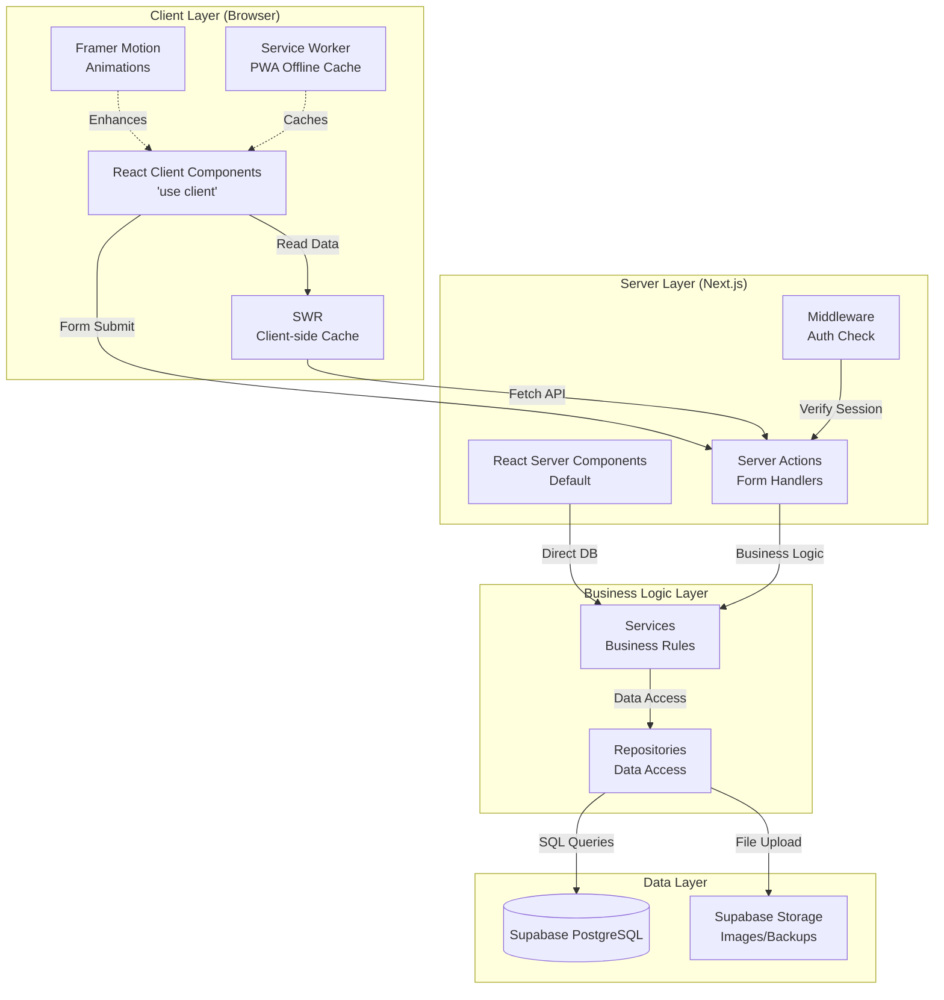
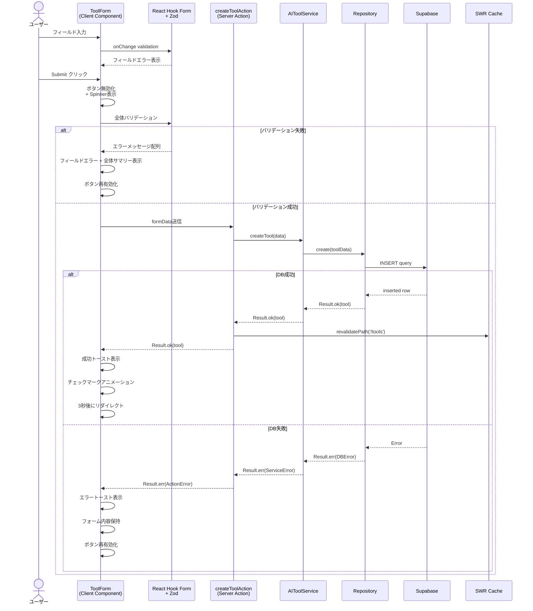
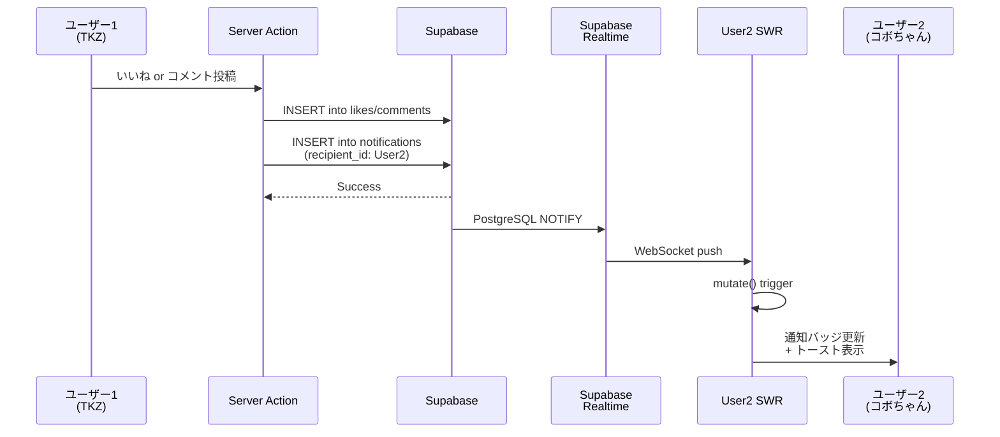
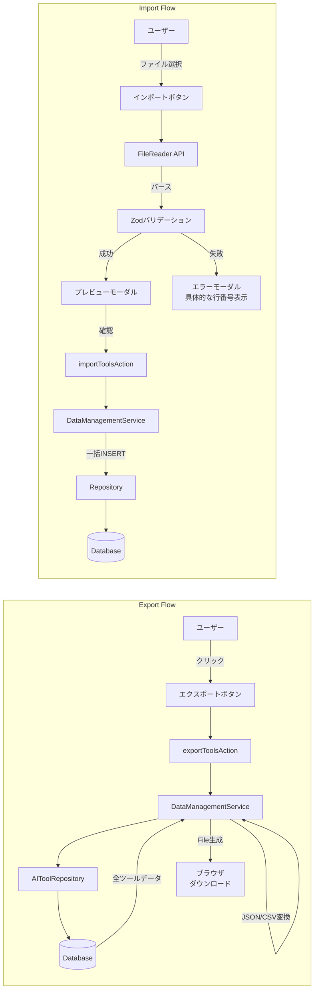
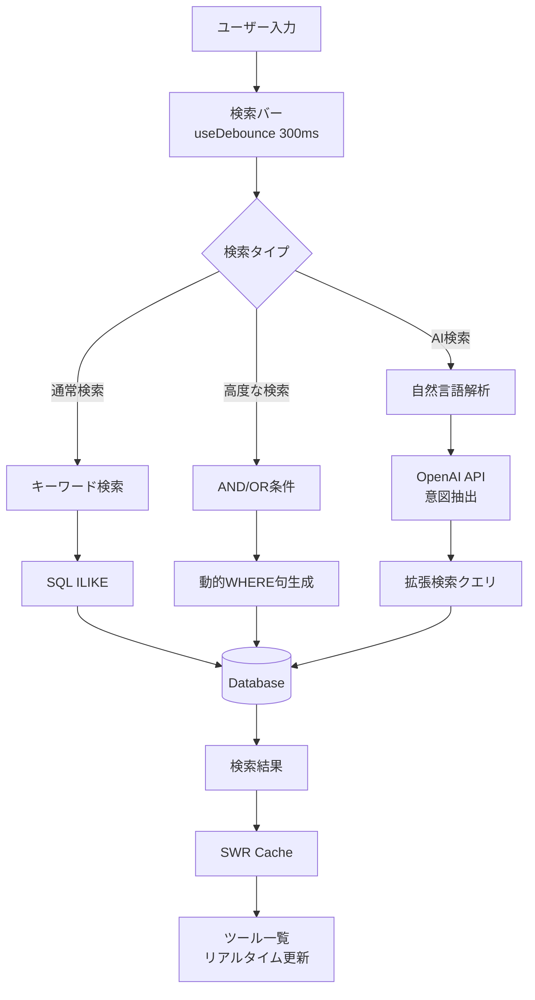
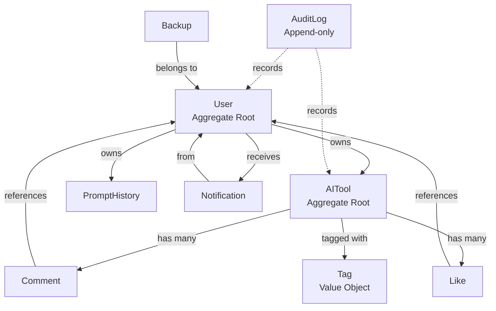

# Technical Design Document

## Overview

本プロジェクトは、AIツール情報共有＆Sora2プロンプト生成アプリの全面的なUIUX改善を実現する。現在の基本機能は動作しているが、視認性、レスポンシブ対応、アクセシビリティ、パフォーマンス、セキュリティの各側面で改善が必要である。本設計では、既存のNext.js 15 + React 19 + TypeScript + Tailwind CSS v4アーキテクチャを維持しながら、新しいデザインシステムとインタラクション層を追加する。

**Purpose**: TKZとコボちゃんが毎日使いたくなる、美しく便利で信頼できるアプリを実現する。視覚的に「ワクワクする」近未来感のあるUIと、堅牢なフォーム処理、明確なフィードバック、スムーズなアニメーション、完全なレスポンシブ対応、高いアクセシビリティを提供する。

**Users**: TKZ（開発者）とコボちゃんの2ユーザーが、AIツール情報の登録・閲覧・検索、Soraプロンプトの生成・履歴管理、データのエクスポート・インポート、コラボレーション（コメント、いいね、通知）を行う。

**Impact**: 既存のServer Action + Repository + Service パターンを保持し、UIレイヤー（コンポーネント、スタイリング、アニメーション）を大幅に刷新する。データモデルは拡張されるが、後方互換性を維持する。新しいテーブル（tags、comments、likes、notifications、audit_logs、backups）が追加される。

### Goals

- 統一された「クリーン＆ワクワク」デザインシステムの確立（色、タイポグラフィ、スペーシング、コンポーネント）
- レスポンシブデザイン完全対応（モバイル 320px〜デスクトップ 1920px+）
- フォームUX向上（リアルタイムバリデーション、明確なエラー表示、ローディング状態、自動保存）
- マイクロインタラクション実装（Framer Motion使用）でワクワク感の創出
- ダークモード対応（システム連動 + 手動切り替え）
- パフォーマンス最適化（画像遅延読み込み、SWRキャッシング、バーチャルスクロール）
- アクセシビリティ完全対応（WCAG 2.1 AA準拠、Lighthouse 100）
- データ管理機能追加（エクスポート/インポート、自動バックアップ）
- 検索・フィルタリング強化（高度な検索、タグ、保存済み検索、AI検索）
- コラボレーション機能（コメント、いいね、活動フィード、通知）
- セキュリティ強化（2FA、セッション管理、監査ログ）

### Non-Goals

- 既存のバックエンドアーキテクチャ（Server Action + Repository + Service）の変更
- 認証プロバイダーの追加（Google OAuthのみ継続）
- マルチテナント対応（2ユーザー固定）
- リアルタイム同時編集（コラボレーションは非同期のみ）
- AI機能の拡張（Sora2プロンプト生成以外のAIツール統合）
- モバイルネイティブアプリ開発（PWA対応のみ）

## Architecture

### Existing Architecture Analysis

現在のアプリケーションは、**Next.js 15 App Router** による **サーバーファースト・アーキテクチャ** を採用している。

**主要パターン**:
- **Server Components First**: デフォルトでRSC、必要に応じて `'use client'` でクライアントコンポーネント化
- **Repository-Service-Action Pattern**: データアクセス層（Repository）、ビジネスロジック層（Service）、UI層（Server Action）の3層分離
- **Result Type Pattern**: `Result<T, E>` で統一的なエラーハンドリング（lib/types/result.ts）
- **Zod Validation**: フォームバリデーションをZodスキーマで型安全に実装
- **CSS Variables + Tailwind**: グローバルCSS変数（`--primary`, `--background`等）でテーマ管理
- **Optimistic UI**: `useOptimistic` hookで楽観的更新（React 19）
- **Sonner Toast**: グローバル通知UI

**既存のディレクトリ構造**:
```
app/                    # Next.js App Router
  layout.tsx           # RootLayout (SessionProvider)
  page.tsx             # ホーム画面
  tools/               # AIツール管理
  prompt/              # プロンプト生成
  history/             # プロンプト履歴
  api/auth/            # NextAuth.js エンドポイント
components/
  ui/                  # Radix UI + shadcn/ui ベースコンポーネント
  tools/               # AIツール関連コンポーネント
  prompt/              # プロンプト関連コンポーネント
  layout/              # ナビゲーション
  auth/                # 認証UI
lib/
  actions/             # Server Actions
  services/            # ビジネスロジック
  repositories/        # データアクセス
  schemas/             # Zodスキーマ
  auth/                # 認証ヘルパー
  supabase/            # Supabaseクライアント
```

**データベース**:
- Supabase (PostgreSQL)
- 現在のテーブル: `users`, `ai_tools`, `prompt_history`
- RLS (Row Level Security) 有効

**既存のコンポーネント例**:
- `Button`, `Input`, `Textarea`, `Select`, `Card`, `Spinner` (shadcn/ui ベース)
- `Navbar` (デスクトップ + モバイルハンバーガー)
- `ToolCard`, `ToolForm` (AIツール管理)
- `PromptForm`, `PromptGenerator` (Sora2プロンプト生成)

### High-Level Architecture

本リデザインは、既存のサーバーファースト・アーキテクチャを維持し、**UI層とデータ層に機能追加**する。



**Architecture Integration**:
- **既存パターン保持**: Repository-Service-Action 3層分離を継続
- **新コンポーネント理由**:
  - **DesignSystemProvider**: CSS変数の動的管理（テーマ切り替え）
  - **AnimationProvider**: Framer Motion 共通設定（reduced-motion対応）
  - **DataManagementService**: エクスポート/インポート/バックアップロジック
  - **NotificationService**: リアルタイム通知配信（Supabase Realtime）
  - **SearchService**: 高度な検索・フィルタリング（全文検索、タグ、AI検索）
- **Technology alignment**: React 19 + Next.js 15 + TypeScript + Tailwind v4継続、Motion（旧Framer Motion）、SWR、@serwist/next（PWA）を追加
- **Steering compliance**:
  - モノレポ構造維持（app/, components/, lib/）
  - テスト駆動開発（Vitest + Playwright）
  - 型安全性（TypeScript strict mode）
  - アクセシビリティファースト（ARIA属性、キーボードナビゲーション）

### Technology Stack and Design Decisions

**Technology Alignment Section** (既存スタックへの追加)

本プロジェクトは既存の技術スタックを基盤とし、UIUX改善に必要な追加ライブラリを導入する。

**既存スタック（継続使用）**:
- **Framework**: Next.js 15.5.6 (App Router)
- **UI Library**: React 19.2.0
- **Language**: TypeScript 5.9.3 (strict mode)
- **Styling**: Tailwind CSS v4.1.14 + PostCSS
- **Component Library**: Radix UI + shadcn/ui（カスタマイズ済み）
- **Icons**: lucide-react 0.546.0
- **Forms**: React Hook Form 7.65.0 + Zod 4.1.12
- **Auth**: NextAuth.js v5 (Google OAuth)
- **Database**: Supabase (PostgreSQL + Realtime + Storage)
- **Toast Notifications**: Sonner 2.0.7
- **Testing**: Vitest 3.2.4 + Playwright 1.56.1

**新規追加ライブラリ**:

1. **Motion (Framer Motion) 12.0.0+**
   - **理由**: 60fps GPU加速アニメーションでワクワク感を実現
   - **用途**: ボタンリップル、カードホバー、ページ遷移、チェックマークアニメーション
   - **注意**: `import { motion } from "motion/react"` で React 19互換
   - **設定**: `'use client'` 必須、`AnimatePresence` でアンマウント時アニメーション

2. **SWR 2.x**
   - **理由**: クライアントサイドデータフェッチングとキャッシング戦略
   - **用途**: AIツール一覧、プロンプト履歴、通知のリアルタイム更新
   - **注意**: App Routerでは `'use client'` 必須、Server Actionsと組み合わせ
   - **設定**: `SWRConfig` でグローバル設定（dedupingInterval、revalidateOnFocus）

3. **@serwist/next 10.x**
   - **理由**: PWA対応、オフラインキャッシュ（Workbox後継）
   - **用途**: Service Worker生成、静的アセットキャッシュ、オフライン閲覧
   - **注意**: Next.js 15互換性を確認、next.config.ts で withSerwist()
   - **設定**: runtimeCaching でAPI キャッシュ戦略設定

4. **react-virtualized-auto-sizer + react-window** (optional, 優先度低)
   - **理由**: 100件以上のツール表示時のパフォーマンス最適化
   - **用途**: AIツール一覧でバーチャルスクロール
   - **代替案**: 初期はページネーションで対応、必要に応じて導入

**新規追加が必要な依存関係**:
```json
{
  "dependencies": {
    "motion": "^12.0.0",
    "swr": "^2.2.0"
  },
  "devDependencies": {
    "@serwist/next": "^10.0.0",
    "@serwist/webpack-plugin": "^10.0.0"
  }
}
```

**Key Design Decisions**

以下の3つの重要な技術決定が実装に大きく影響する。

#### Decision 1: デザインシステムの実装戦略

**Decision**: CSS変数ベースのデザイントークンシステム + Tailwind拡張

**Context**:
- 要件で「統一されたデザインシステム」「青系グラデーション」「ダークモード」が必要
- 既存のTailwind CSS v4 + CSS変数システムが存在
- コンポーネントライブラリ（shadcn/ui）を大幅に変更せず、デザイン刷新が必要

**Alternatives**:
1. **CSS-in-JS (Styled Components / Emotion)**: 動的スタイリング可能だが、Next.js App RouterでのSSR設定が複雑、バンドルサイズ増加
2. **Vanilla Extract**: 型安全なCSS-in-TS、ゼロランタイムだが、既存Tailwind資産を捨てる必要あり
3. **Panda CSS**: Tailwindライクな記法でゼロランタイムだが、新しいツールチェーン、学習コスト高

**Selected Approach**:
既存のCSS変数システム（`--primary`, `--secondary`, `--accent`）を拡張し、グラデーション用変数（`--gradient-primary`, `--gradient-accent`）を追加。Tailwind設定で `extend.colors` に新しいカラーパレットを定義。

```css
/* app/globals.css 拡張例 */
:root {
  /* 既存の単色変数 */
  --primary: 221.2 83.2% 53.3%;

  /* 新規: グラデーション変数 */
  --gradient-primary: linear-gradient(135deg, #3b82f6 0%, #8b5cf6 100%);
  --gradient-accent: linear-gradient(135deg, #f59e0b 0%, #f97316 100%);

  /* 新規: スペーシング */
  --spacing-xs: 0.25rem; /* 4px */
  --spacing-sm: 0.5rem;  /* 8px */
  --spacing-md: 1rem;    /* 16px */
  --spacing-lg: 1.5rem;  /* 24px */
  --spacing-xl: 2rem;    /* 32px */
}

.dark {
  --gradient-primary: linear-gradient(135deg, #60a5fa 0%, #a78bfa 100%);
}
```

```typescript
// tailwind.config.ts 拡張
extend: {
  backgroundImage: {
    'gradient-primary': 'var(--gradient-primary)',
    'gradient-accent': 'var(--gradient-accent)',
  },
  spacing: {
    'xs': 'var(--spacing-xs)',
    'sm': 'var(--spacing-sm)',
    'md': 'var(--spacing-md)',
    'lg': 'var(--spacing-lg)',
    'xl': 'var(--spacing-xl)',
  }
}
```

**Rationale**:
- 既存のTailwind資産を最大限活用しつつ、デザイン刷新可能
- CSS変数によるダークモード切り替えが容易（既存の `.dark` クラス戦略を継続）
- コンポーネント変更を最小化（className変更のみ）
- ゼロランタイムコスト（Tailwindはビルド時処理）
- TypeScript型安全性は失うが、学習コストが低い

**Trade-offs**:
- **得るもの**: 既存コードベースとの互換性、シンプルな実装、高速なビルド
- **失うもの**: CSS-in-JSの動的スタイリング、Vanilla ExtractのTypeScript型安全性

#### Decision 2: アニメーションライブラリの選定

**Decision**: Motion (旧Framer Motion) を採用

**Context**:
- 要件で「マイクロインタラクション（リップル、ホバー、フェード、飛び込み、チェックマーク）」が必須
- React 19 + Next.js 15互換性が必要
- 60fps、GPU加速が必要

**Alternatives**:
1. **React Spring**: 物理ベースアニメーション、細かい制御可能だが、学習曲線が急、設定が冗長
2. **CSS Transitions/Animations**: ゼロJS、高速だが、複雑なシーケンスや状態遷移が困難
3. **GSAP (GreenSock)**: 最強のアニメーションライブラリだが、商用ライセンス必要、React統合が煩雑

**Selected Approach**:
Motion (Framer Motion の後継) 12.0.0+ を使用。React 19互換の `motion/react` からインポート。

```typescript
'use client'
import { motion, AnimatePresence } from "motion/react"

// ボタンリップル効果
<motion.button
  whileTap={{ scale: 0.95 }}
  className="..."
>
  Submit
</motion.button>

// カードホバー
<motion.div
  whileHover={{ y: -4, boxShadow: "0 10px 30px rgba(0,0,0,0.2)" }}
  transition={{ duration: 0.2 }}
>
  <ToolCard />
</motion.div>

// ページ遷移
<AnimatePresence mode="wait">
  <motion.div
    key={pathname}
    initial={{ opacity: 0, y: 20 }}
    animate={{ opacity: 1, y: 0 }}
    exit={{ opacity: 0, y: -20 }}
    transition={{ duration: 0.3 }}
  >
    {children}
  </motion.div>
</AnimatePresence>
```

**Rationale**:
- **React 19互換**: `motion/react` パッケージで公式サポート
- **宣言的API**: `whileHover`, `whileTap`, `initial/animate/exit` で直感的
- **パフォーマンス**: GPU加速（transform, opacity）、60fps保証
- **Reduced Motion対応**: `prefers-reduced-motion` 自動検知
- **小さいバンドルサイズ**: Tree-shakable、必要な機能のみインポート

**Trade-offs**:
- **得るもの**: React統合の簡潔さ、豊富なドキュメント、コミュニティサポート
- **失うもの**: GSAPの高度な制御、React Springの物理シミュレーション精度

#### Decision 3: データフェッチング戦略の二重化

**Decision**: Server Actions (サーバーサイド) + SWR (クライアントサイド) のハイブリッド

**Context**:
- 既存のServer ActionsでCRUD操作実装済み
- 要件で「リアルタイム通知」「活動フィード」「検索結果のリアルタイム絞り込み」が必要
- Next.js 15 App Routerのサーバーファースト原則を維持

**Alternatives**:
1. **Server Actions のみ**: シンプル、SEO最適、初回ロード高速だが、クライアント側のリアルタイム更新が困難
2. **SWR のみ**: クライアント側で統一、キャッシュ戦略が強力だが、初回ロード遅延、SEO不利
3. **React Query (TanStack Query)**: SWRより高機能だが、学習コスト高、Server Actionsとの統合パターンが未確立

**Selected Approach**:
```typescript
// パターン1: 初回レンダリング (Server Component)
async function ToolsPage() {
  const tools = await aiToolService.getAllTools()
  return <ToolsList initialData={tools} />
}

// パターン2: クライアント側リフレッシュ (Client Component with SWR)
'use client'
function ToolsList({ initialData }) {
  const { data, mutate } = useSWR('/api/tools', fetcher, {
    fallbackData: initialData,
    revalidateOnFocus: true,
    dedupingInterval: 5000,
  })

  // Server Actionでミューテーション後、SWRキャッシュ更新
  async function handleCreate(formData) {
    await createToolAction(formData)
    mutate() // SWR revalidate
  }

  return <div>{data.map(tool => <ToolCard {...tool} />)}</div>
}
```

**Use Cases**:
- **Server Actions**: フォーム送信（作成、更新、削除）、認証操作
- **SWR**: ツール一覧の自動リフレッシュ、通知ポーリング、検索結果のリアルタイム更新

**Rationale**:
- **Best of Both Worlds**: 初回ロードの高速性（Server Components）+ リアルタイム性（SWR）
- **SEO維持**: Server ComponentsでHTMLを生成
- **UX向上**: フォーカス時自動リフレッシュ、楽観的更新との組み合わせ
- **キャッシュ戦略**: SWRのstale-while-revalidateで体感速度向上

**Trade-offs**:
- **得るもの**: 初回ロード高速 + リアルタイム更新、SEO対応
- **失うもの**: シンプルさ（2つのデータフェッチパターン管理必要）、若干の複雑性

## System Flows

本セクションでは、UIUX改善で追加される主要なユーザーフローと技術的なデータフローを可視化する。

### User Interaction Flows

#### Flow 1: フォーム送信フロー（エラーハンドリング付き）



#### Flow 2: リアルタイム通知フロー



### Data Flow Diagrams

#### Data Flow 1: エクスポート/インポートフロー



#### Data Flow 2: 検索フィルタリングフロー



## Requirements Traceability

主要な要件が技術コンポーネントにどのようにマッピングされるかを示す。

| Requirement | 要件概要 | 実現コンポーネント | インターフェース | 関連フロー |
|-------------|---------|-----------------|-------------|----------|
| 1.1-1.7 | フォームUX向上 | `ToolForm`, `PromptForm` (React Hook Form + Zod) | `createToolAction`, `updateToolAction` | Flow 1: フォーム送信 |
| 2.1-2.6 | 認証フロー改善 | `auth.config.ts`, `lib/auth/helpers.ts`, `LoginForm` | `signIn`, `signOut`, `requireAuth` | - |
| 3.1-3.6 | データ操作安全性 | `ConfirmDialog`, `useUnsavedChanges` hook, `SoftDeleteService` | `deleteToolAction` (soft delete) | - |
| 4.1-4.6 | デザインシステム | `app/globals.css` (CSS変数), `tailwind.config.ts` | - | - |
| 5.1-5.9 | コンポーネント刷新 | `Button`, `Card`, `Select`, `Input`, `Textarea` (リデザイン) | - | - |
| 6.1-6.9 | レスポンシブ対応 | `Navbar` (モバイル/デスクトップ), `BottomNav` (新規), `useMediaQuery` hook | - | - |
| 7.1-7.5 | ナビゲーション | `Navbar`, `Breadcrumbs` (新規), `GlobalSearch` (新規) | `searchAction` | Flow 2: 検索 |
| 8.1-8.6 | マイクロインタラクション | Motion wrappers (`AnimatedButton`, `AnimatedCard`) | - | - |
| 9.1-9.5 | ダークモード | `ThemeProvider`, `ThemeToggle` | `setTheme()` | - |
| 10.1-10.8 | データ管理 | `DataManagementService`, `ExportButton`, `ImportButton` | `exportToolsAction`, `importToolsAction` | Flow 1: Export/Import |
| 11.1-11.8 | 検索強化 | `SearchService`, `AdvancedSearchPanel`, `SavedSearches` | `advancedSearchAction`, `aiSearchAction` | Flow 2: 検索 |
| 12.1-12.8 | コラボレーション | `CommentSection`, `LikeButton`, `NotificationBell`, `ActivityFeed` | `createCommentAction`, `toggleLikeAction`, `NotificationService` | Flow 2: リアルタイム通知 |
| 13.1-13.8 | プロンプト生成強化 | `PromptTemplateSelector`, `VariationGenerator`, `AIImprovementSuggestion` | `generateVariationsAction`, `suggestImprovementsAction` | - |
| 14.1-14.7 | パフォーマンス最適化 | `LazyImage` (Intersection Observer), `VirtualList` (optional), SWR config | - | - |
| 15.1-15.8 | アクセシビリティ | 全コンポーネント (ARIA属性追加), `FocusTrap`, `SkipNav` | - | - |
| 16.1-16.8 | セキュリティ強化 | `TwoFactorAuthSetup`, `SessionManager`, `AuditLogService` | `enable2FAAction`, `logoutSessionAction`, `logAuditAction` | - |

## Components and Interfaces

### Presentation Layer (UI Components)

#### DesignSystemProvider

**Responsibility & Boundaries**
- **Primary Responsibility**: CSS変数ベースのデザイントークン管理とテーマ切り替え
- **Domain Boundary**: プレゼンテーション層、全コンポーネントの最上位
- **Data Ownership**: テーマ状態（light/dark/system）、カラーパレット変数
- **Transaction Boundary**: N/A（UI状態のみ）

**Dependencies**
- **Inbound**: 全UIコンポーネント（Context経由でテーマ取得）
- **Outbound**: localStorage（テーマ設定永続化）、next-themes（オプション）
- **External**: なし

**Contract Definition**

**Service Interface**:
```typescript
interface DesignSystemContextValue {
  theme: 'light' | 'dark' | 'system';
  setTheme: (theme: 'light' | 'dark' | 'system') => void;
  resolvedTheme: 'light' | 'dark'; // system解決後の実際のテーマ
}

interface DesignSystemProviderProps {
  children: React.ReactNode;
  defaultTheme?: 'light' | 'dark' | 'system';
}
```

- **Preconditions**: ブラウザ環境（window.matchMedia 利用）
- **Postconditions**: テーマ変更時にCSS変数が即座に更新され、500msトランジション実行
- **Invariants**: resolvedTheme は常に 'light' または 'dark' （'system' は含まれない）

**State Management**:
- **State Model**: `theme` (light/dark/system) → `resolvedTheme` (light/dark)
- **Persistence**: localStorage キー `'app-theme'`
- **Concurrency**: N/A（単一ユーザーのブラウザ状態）

#### AnimatedButton

**Responsibility & Boundaries**
- **Primary Responsibility**: ボタンコンポーネントにマイクロインタラクション（リップル、スケール）を追加
- **Domain Boundary**: プレゼンテーション層、`Button` コンポーネントのラッパー
- **Data Ownership**: アニメーション状態のみ
- **Transaction Boundary**: N/A

**Dependencies**
- **Inbound**: 全フォーム、ナビゲーション
- **Outbound**: `motion` (motion/react), `Button` (components/ui/button)
- **External**: Motion (Framer Motion)

**External Dependencies Investigation**:
- **Motion (Framer Motion)**: `motion/react` パッケージから `motion` コンポーネントをインポート
- **API**: `whileTap={{ scale: 0.95 }}`, `whileHover={{ scale: 1.05 }}`, `transition={{ duration: 0.2 }}`
- **React 19互換性**: 公式サポート（12.0.0+）
- **パフォーマンス**: GPU加速（transform使用）、60fps保証
- **Reduced Motion**: `prefers-reduced-motion: reduce` 時は自動的にアニメーション無効化
- **バンドルサイズ**: ~40KB (gzipped, tree-shakable)

**Contract Definition**

```typescript
interface AnimatedButtonProps extends ButtonProps {
  ripple?: boolean; // リップル効果有効化
  scaleOnTap?: boolean; // タップ時スケール
  scaleOnHover?: boolean; // ホバー時スケール
}

// 使用例
<AnimatedButton
  ripple={true}
  scaleOnTap={true}
  onClick={handleSubmit}
>
  Submit
</AnimatedButton>
```

- **Preconditions**: `'use client'` コンポーネント内で使用
- **Postconditions**: クリック時に95%スケール → 元サイズ（200msトランジション）
- **Invariants**: ボタンが無効状態（disabled）時はアニメーション実行しない

#### GlobalSearch

**Responsibility & Boundaries**
- **Primary Responsibility**: グローバル検索UI（Ctrl+K起動、AIツール・プロンプト・カテゴリー横断検索）
- **Domain Boundary**: ナビゲーション層、Navbarに統合
- **Data Ownership**: 検索クエリ、検索結果キャッシュ（SWR）
- **Transaction Boundary**: N/A（読み取り専用）

**Dependencies**
- **Inbound**: `Navbar`, キーボードショートカット（useHotkeys）
- **Outbound**: `SearchService`, `CommandPalette` (cmdk), SWR
- **External**: cmdk (Command Palette UI), SWR

**Contract Definition**

**Service Interface**:
```typescript
interface GlobalSearchProps {
  placeholder?: string;
  shortcuts?: string[]; // デフォルト ['Ctrl+K', 'Cmd+K']
}

interface SearchResult {
  type: 'tool' | 'prompt' | 'category';
  id: string;
  title: string;
  description: string;
  url: string;
}
```

- **Preconditions**: ユーザー認証済み
- **Postconditions**: 検索結果クリック時に該当ページへ遷移、モーダル閉じる
- **Invariants**: 検索クエリが空の場合は結果を表示しない

**Integration Strategy**:
- **Modification Approach**: `Navbar` コンポーネントに新規追加（既存ナビゲーションリンクの右側）
- **Backward Compatibility**: 既存ナビゲーションに影響なし
- **Migration Path**: Phase 1で基本検索、Phase 2で AI検索追加

### Business Logic Layer (Services)

#### SearchService

**Responsibility & Boundaries**
- **Primary Responsibility**: 高度な検索ロジック（キーワード、AND/OR条件、日付範囲、タグ、AI検索）
- **Domain Boundary**: ビジネスロジック層
- **Data Ownership**: 検索条件の正規化、検索結果の整形
- **Transaction Boundary**: 読み取りのみ（トランザクション不要）

**Dependencies**
- **Inbound**: `GlobalSearch`, `AdvancedSearchPanel`, `searchAction` (Server Action)
- **Outbound**: `AIToolRepository`, `PromptHistoryRepository`, OpenAI API（AI検索時）
- **External**: OpenAI API (gpt-4o-mini for意図抽出)

**External Dependencies Investigation**:
- **OpenAI API**: 既存の `lib/clients/openai-client.ts` を再利用
- **AI検索フロー**: ユーザー入力（自然言語） → OpenAI API（意図抽出） → 構造化検索クエリ → Repository
- **Rate Limits**: OpenAI Tier 1 (500 RPM, 30,000 TPM) - 個人用途で十分
- **コスト**: gpt-4o-mini ($0.15/1M input tokens, $0.60/1M output tokens) - 1検索あたり約0.001円
- **エラーハンドリング**: API失敗時は通常のキーワード検索にフォールバック

**Contract Definition**

**Service Interface**:
```typescript
interface SearchService {
  simpleSearch(query: string): Promise<Result<SearchResult[], SearchError>>;
  advancedSearch(conditions: AdvancedSearchConditions): Promise<Result<SearchResult[], SearchError>>;
  aiSearch(naturalLanguageQuery: string): Promise<Result<SearchResult[], SearchError>>;
  saveSearch(userId: string, name: string, conditions: AdvancedSearchConditions): Promise<Result<SavedSearch, SearchError>>;
}

interface AdvancedSearchConditions {
  keyword?: string;
  operator: 'AND' | 'OR';
  category?: string[];
  dateRange?: { start: Date; end: Date };
  ratingRange?: { min: number; max: number };
  tags?: string[];
}

interface SearchResult {
  type: 'tool' | 'prompt';
  id: string;
  title: string;
  description: string;
  relevanceScore: number; // 0-100
}
```

- **Preconditions**:
  - `simpleSearch`: query長さ > 0
  - `advancedSearch`: 少なくとも1つの条件指定
  - `aiSearch`: OpenAI APIキー設定済み
- **Postconditions**: 関連度スコア降順でソートされた結果配列
- **Invariants**: relevanceScore は 0〜100 の範囲

**Error Categories**:
- `SearchError.InvalidQuery`: バリデーションエラー
- `SearchError.AIServiceUnavailable`: OpenAI API失敗（フォールバックあり）
- `SearchError.DatabaseError`: DB接続エラー

#### DataManagementService

**Responsibility & Boundaries**
- **Primary Responsibility**: データのエクスポート、インポート、バックアップ、復元
- **Domain Boundary**: ビジネスロジック層
- **Data Ownership**: エクスポートファイル形式（JSON/CSV）の定義、バックアップメタデータ
- **Transaction Boundary**: インポート時は全体がトランザクション（全成功 or 全失敗）

**Dependencies**
- **Inbound**: `exportToolsAction`, `importToolsAction`, `createBackupAction`, `restoreBackupAction`
- **Outbound**: `AIToolRepository`, `PromptHistoryRepository`, Supabase Storage (バックアップファイル保存)
- **External**: Supabase Storage API

**Contract Definition**

**Service Interface**:
```typescript
interface DataManagementService {
  exportTools(userId: string, format: 'json' | 'csv'): Promise<Result<Blob, ExportError>>;
  importTools(userId: string, file: File): Promise<Result<ImportResult, ImportError>>;
  createBackup(userId: string): Promise<Result<Backup, BackupError>>;
  restoreBackup(userId: string, backupId: string): Promise<Result<void, RestoreError>>;
  listBackups(userId: string): Promise<Result<Backup[], BackupError>>;
}

interface ImportResult {
  successCount: number;
  errorCount: number;
  errors: Array<{ row: number; message: string }>;
}

interface Backup {
  id: string;
  userId: string;
  createdAt: Date;
  size: number; // bytes
  toolCount: number;
  promptCount: number;
  storageUrl: string; // Supabase Storage URL
}
```

- **Preconditions**:
  - `exportTools`: ユーザーが最低1件のツールを持つ
  - `importTools`: ファイルサイズ < 10MB、有効なJSON/CSV形式
  - `restoreBackup`: バックアップが存在し、ユーザーの所有物
- **Postconditions**:
  - `importTools`: 成功した行のみDBに挿入、エラー行は結果に含める
  - `createBackup`: Supabase Storageにファイルアップロード完了
- **Invariants**: バックアップファイルは30日後に自動削除（Supabase Storage TTL設定）

**Integration Strategy**:
- **Modification Approach**: 新規サービス追加（既存サービスと独立）
- **Backward Compatibility**: 既存のツール作成・更新フローに影響なし
- **Migration Path**:
  - Phase 1: エクスポート/インポート（手動）
  - Phase 2: 自動バックアップ（cron job, Supabase Edge Functions）

#### NotificationService

**Responsibility & Boundaries**
- **Primary Responsibility**: リアルタイム通知の配信、既読管理、通知設定
- **Domain Boundary**: ビジネスロジック層
- **Data Ownership**: 通知データ（種類、メッセージ、既読状態）
- **Transaction Boundary**: 通知作成時（likes/commentsとatomic）

**Dependencies**
- **Inbound**: `toggleLikeAction`, `createCommentAction`, `NotificationBell` (UI)
- **Outbound**: `NotificationRepository`, Supabase Realtime
- **External**: Supabase Realtime (PostgreSQL NOTIFY/LISTEN)

**External Dependencies Investigation**:
- **Supabase Realtime**: WebSocketベース、PostgreSQL変更通知をリアルタイム配信
- **設定**: テーブルに `REPLICA IDENTITY FULL` 設定、Row Level Security有効
- **Channels**: `notifications:user_id` チャンネルでユーザー別購読
- **認証**: Supabase JWTで自動認証
- **接続管理**: 自動再接続、接続断時は次回ポーリング

**Contract Definition**

**Service Interface**:
```typescript
interface NotificationService {
  createNotification(data: CreateNotificationData): Promise<Result<Notification, NotificationError>>;
  markAsRead(notificationId: string, userId: string): Promise<Result<void, NotificationError>>;
  markAllAsRead(userId: string): Promise<Result<void, NotificationError>>;
  getUnreadCount(userId: string): Promise<Result<number, NotificationError>>;
  subscribeToNotifications(userId: string, callback: (notification: Notification) => void): () => void; // unsubscribe関数を返す
}

interface CreateNotificationData {
  recipientId: string;
  type: 'like' | 'comment' | 'tool_created';
  actorId: string;
  resourceType: 'tool' | 'prompt';
  resourceId: string;
  message: string;
}

interface Notification {
  id: string;
  recipientId: string;
  type: 'like' | 'comment' | 'tool_created';
  actorId: string;
  actorName: string;
  message: string;
  resourceUrl: string;
  isRead: boolean;
  createdAt: Date;
}
```

- **Preconditions**: recipientId が有効なユーザーID
- **Postconditions**:
  - `createNotification`: DB挿入 → Realtime配信 → クライアント側トースト表示
  - `subscribeToNotifications`: コールバックがリアルタイムで呼ばれる
- **Invariants**: 既読通知は未読に戻せない

**Event Contract**:
- **Published Events**:
  - `notification:created` (Supabase Realtime経由)
  - Payload: `{ type: 'INSERT', table: 'notifications', record: Notification }`
- **Subscribed Events**: なし（このサービスは通知を生成する側）
- **Delivery**: At-least-once（Supabase Realtimeの保証）

### Data Access Layer (Repositories)

#### TagRepository (新規)

**Responsibility & Boundaries**
- **Primary Responsibility**: タグの CRUD、ツールへのタグ紐付け、タグ検索
- **Domain Boundary**: データアクセス層
- **Data Ownership**: `tags`, `tool_tags` テーブル
- **Transaction Boundary**: タグ作成とツール紐付けはatomic

**Dependencies**
- **Inbound**: `AIToolService`, `SearchService`
- **Outbound**: Supabase client
- **External**: なし

**Contract Definition**

**Service Interface**:
```typescript
interface TagRepository {
  create(name: string): Promise<Result<Tag, RepositoryError>>;
  findByName(name: string): Promise<Result<Tag | null, RepositoryError>>;
  findAllByToolId(toolId: string): Promise<Result<Tag[], RepositoryError>>;
  findAllWithUsageCount(): Promise<Result<TagWithCount[], RepositoryError>>;
  attachToTool(toolId: string, tagIds: string[]): Promise<Result<void, RepositoryError>>;
  detachFromTool(toolId: string, tagIds: string[]): Promise<Result<void, RepositoryError>>;
}

interface Tag {
  id: string;
  name: string;
  createdAt: Date;
}

interface TagWithCount {
  id: string;
  name: string;
  usageCount: number; // 何個のツールに紐付いているか
}
```

- **Preconditions**:
  - `create`: タグ名は1〜50文字、重複チェック
  - `attachToTool`: toolId, tagId が有効
- **Postconditions**:
  - `create`: 既存タグがあれば既存IDを返す（冪等性）
  - `attachToTool`: 既に紐付いている場合はスキップ
- **Invariants**: タグ名は大文字小文字を区別しない（検索時 LOWER(name) 使用）

#### AuditLogRepository (新規)

**Responsibility & Boundaries**
- **Primary Responsibility**: 監査ログの記録、閲覧、検索
- **Domain Boundary**: データアクセス層
- **Data Ownership**: `audit_logs` テーブル
- **Transaction Boundary**: ログ記録は他のトランザクションと独立（非同期推奨）

**Dependencies**
- **Inbound**: 全Server Actions（重要操作時）、`AuditLogService`
- **Outbound**: Supabase client
- **External**: なし

**Contract Definition**

**Service Interface**:
```typescript
interface AuditLogRepository {
  create(data: CreateAuditLogData): Promise<Result<AuditLog, RepositoryError>>;
  findByUserId(userId: string, pagination: Pagination): Promise<Result<AuditLog[], RepositoryError>>;
  findByActionType(actionType: AuditActionType, pagination: Pagination): Promise<Result<AuditLog[], RepositoryError>>;
  search(conditions: AuditLogSearchConditions): Promise<Result<AuditLog[], RepositoryError>>;
}

type AuditActionType =
  | 'tool_created' | 'tool_updated' | 'tool_deleted'
  | 'prompt_generated' | 'export_data' | 'import_data'
  | '2fa_enabled' | '2fa_disabled' | 'session_logout';

interface CreateAuditLogData {
  userId: string;
  actionType: AuditActionType;
  resourceType?: 'tool' | 'prompt' | 'user';
  resourceId?: string;
  ipAddress: string;
  userAgent: string;
  metadata?: Record<string, unknown>; // JSON field
}

interface AuditLog {
  id: string;
  userId: string;
  actionType: AuditActionType;
  resourceType?: 'tool' | 'prompt' | 'user';
  resourceId?: string;
  ipAddress: string;
  userAgent: string;
  metadata?: Record<string, unknown>;
  createdAt: Date;
}
```

- **Preconditions**: userId が有効
- **Postconditions**: ログは削除不可（Append-only）
- **Invariants**: createdAt は過去の日時（タイムスタンプ改ざん防止）

## Data Models

### Domain Model

**Core Concepts**:

本アプリケーションは以下のドメインエンティティで構成される。

- **User** (Entity): ユーザーアカウント、認証情報の所有者
- **AITool** (Aggregate Root): AIツール情報、ユーザーが登録する中心的なエンティティ
- **PromptHistory** (Entity): Soraプロンプト生成履歴
- **Tag** (Value Object): AIツールに付与されるタグ（名前のみ）
- **Comment** (Entity): AIツールへのコメント
- **Like** (Value Object): AIツールへの「いいね」
- **Notification** (Entity): ユーザー間通知
- **AuditLog** (Entity): 監査ログ（Append-only）
- **Backup** (Entity): データバックアップメタデータ

**Aggregates**:



**Business Rules & Invariants**:

1. **AITool**:
   - ツール名は1〜100文字
   - URLは有効なHTTP/HTTPS形式
   - カテゴリーは 'text', 'image', 'video', 'audio', 'code', 'other' のいずれか
   - 評価は1〜5の整数
   - ユーザーは自分のツールのみ編集・削除可能
   - 論理削除（deleted_at）後30日でハード削除

2. **Comment**:
   - コメント本文は1〜1000文字
   - 削除されたツールへのコメントは表示しない
   - ユーザーは自分のコメントのみ削除可能

3. **Like**:
   - 1ユーザー × 1ツール = 1いいねまで（重複不可）
   - 自分のツールに自分でいいねは可能

4. **Notification**:
   - 未読通知は30日後に自動削除
   - 既読通知は削除可能

5. **Tag**:
   - タグ名は大文字小文字を区別しない（正規化）
   - 重複タグは作成不可（既存タグを返す）

### Physical Data Model

**For Relational Databases** (Supabase PostgreSQL):

#### 既存テーブル（変更なし）

```sql
-- users テーブル（NextAuth.js管理）
CREATE TABLE users (
  id UUID PRIMARY KEY DEFAULT uuid_generate_v4(),
  name TEXT,
  email TEXT UNIQUE NOT NULL,
  email_verified TIMESTAMPTZ,
  image TEXT,
  created_at TIMESTAMPTZ DEFAULT NOW(),
  updated_at TIMESTAMPTZ DEFAULT NOW()
);

-- ai_tools テーブル
CREATE TABLE ai_tools (
  id UUID PRIMARY KEY DEFAULT uuid_generate_v4(),
  user_id UUID NOT NULL REFERENCES users(id) ON DELETE CASCADE,
  name TEXT NOT NULL,
  description TEXT,
  url TEXT NOT NULL,
  category TEXT NOT NULL CHECK (category IN ('text', 'image', 'video', 'audio', 'code', 'other')),
  rating INTEGER CHECK (rating >= 1 AND rating <= 5),
  notes TEXT,
  deleted_at TIMESTAMPTZ, -- 論理削除
  created_at TIMESTAMPTZ DEFAULT NOW(),
  updated_at TIMESTAMPTZ DEFAULT NOW()
);

-- prompt_history テーブル
CREATE TABLE prompt_history (
  id UUID PRIMARY KEY DEFAULT uuid_generate_v4(),
  user_id UUID NOT NULL REFERENCES users(id) ON DELETE CASCADE,
  input_text TEXT NOT NULL,
  generated_prompt TEXT NOT NULL,
  created_at TIMESTAMPTZ DEFAULT NOW()
);
```

#### 新規テーブル

```sql
-- tags テーブル
CREATE TABLE tags (
  id UUID PRIMARY KEY DEFAULT uuid_generate_v4(),
  name TEXT UNIQUE NOT NULL,
  created_at TIMESTAMPTZ DEFAULT NOW()
);
CREATE INDEX idx_tags_name_lower ON tags (LOWER(name));

-- tool_tags 中間テーブル（多対多）
CREATE TABLE tool_tags (
  tool_id UUID NOT NULL REFERENCES ai_tools(id) ON DELETE CASCADE,
  tag_id UUID NOT NULL REFERENCES tags(id) ON DELETE CASCADE,
  created_at TIMESTAMPTZ DEFAULT NOW(),
  PRIMARY KEY (tool_id, tag_id)
);
CREATE INDEX idx_tool_tags_tool_id ON tool_tags (tool_id);
CREATE INDEX idx_tool_tags_tag_id ON tool_tags (tag_id);

-- comments テーブル
CREATE TABLE comments (
  id UUID PRIMARY KEY DEFAULT uuid_generate_v4(),
  tool_id UUID NOT NULL REFERENCES ai_tools(id) ON DELETE CASCADE,
  user_id UUID NOT NULL REFERENCES users(id) ON DELETE CASCADE,
  content TEXT NOT NULL CHECK (LENGTH(content) >= 1 AND LENGTH(content) <= 1000),
  created_at TIMESTAMPTZ DEFAULT NOW(),
  updated_at TIMESTAMPTZ DEFAULT NOW()
);
CREATE INDEX idx_comments_tool_id ON comments (tool_id);
CREATE INDEX idx_comments_user_id ON comments (user_id);

-- likes テーブル
CREATE TABLE likes (
  tool_id UUID NOT NULL REFERENCES ai_tools(id) ON DELETE CASCADE,
  user_id UUID NOT NULL REFERENCES users(id) ON DELETE CASCADE,
  created_at TIMESTAMPTZ DEFAULT NOW(),
  PRIMARY KEY (tool_id, user_id)
);
CREATE INDEX idx_likes_tool_id ON likes (tool_id);
CREATE INDEX idx_likes_user_id ON likes (user_id);

-- notifications テーブル
CREATE TABLE notifications (
  id UUID PRIMARY KEY DEFAULT uuid_generate_v4(),
  recipient_id UUID NOT NULL REFERENCES users(id) ON DELETE CASCADE,
  actor_id UUID NOT NULL REFERENCES users(id) ON DELETE CASCADE,
  type TEXT NOT NULL CHECK (type IN ('like', 'comment', 'tool_created')),
  resource_type TEXT NOT NULL CHECK (resource_type IN ('tool', 'prompt')),
  resource_id UUID NOT NULL,
  message TEXT NOT NULL,
  is_read BOOLEAN DEFAULT FALSE,
  created_at TIMESTAMPTZ DEFAULT NOW()
);
CREATE INDEX idx_notifications_recipient_id_is_read ON notifications (recipient_id, is_read);
CREATE INDEX idx_notifications_created_at ON notifications (created_at);

-- 30日後に未読通知削除（PostgreSQL + pg_cron）
-- DELETE FROM notifications WHERE created_at < NOW() - INTERVAL '30 days' AND is_read = FALSE;

-- audit_logs テーブル（Append-only）
CREATE TABLE audit_logs (
  id UUID PRIMARY KEY DEFAULT uuid_generate_v4(),
  user_id UUID NOT NULL REFERENCES users(id) ON DELETE CASCADE,
  action_type TEXT NOT NULL,
  resource_type TEXT CHECK (resource_type IN ('tool', 'prompt', 'user')),
  resource_id UUID,
  ip_address INET NOT NULL,
  user_agent TEXT NOT NULL,
  metadata JSONB,
  created_at TIMESTAMPTZ DEFAULT NOW()
);
CREATE INDEX idx_audit_logs_user_id ON audit_logs (user_id);
CREATE INDEX idx_audit_logs_action_type ON audit_logs (action_type);
CREATE INDEX idx_audit_logs_created_at ON audit_logs (created_at);

-- backups テーブル
CREATE TABLE backups (
  id UUID PRIMARY KEY DEFAULT uuid_generate_v4(),
  user_id UUID NOT NULL REFERENCES users(id) ON DELETE CASCADE,
  storage_url TEXT NOT NULL, -- Supabase Storage URL
  file_size BIGINT NOT NULL, -- bytes
  tool_count INTEGER NOT NULL,
  prompt_count INTEGER NOT NULL,
  created_at TIMESTAMPTZ DEFAULT NOW()
);
CREATE INDEX idx_backups_user_id ON backups (user_id);
CREATE INDEX idx_backups_created_at ON backups (created_at);

-- saved_searches テーブル
CREATE TABLE saved_searches (
  id UUID PRIMARY KEY DEFAULT uuid_generate_v4(),
  user_id UUID NOT NULL REFERENCES users(id) ON DELETE CASCADE,
  name TEXT NOT NULL,
  conditions JSONB NOT NULL, -- { keyword, operator, category, dateRange, etc }
  created_at TIMESTAMPTZ DEFAULT NOW()
);
CREATE INDEX idx_saved_searches_user_id ON saved_searches (user_id);
```

**Indexes and Performance Optimization**:
- `idx_ai_tools_user_id_deleted_at`: ユーザーの論理削除されていないツール取得を高速化
- `idx_notifications_recipient_id_is_read`: 未読通知取得を高速化
- `idx_audit_logs_created_at`: 時系列順の監査ログ取得を高速化
- Full-Text Search (将来): `ai_tools.name` と `ai_tools.description` に `tsvector` インデックス追加検討

**Referential Integrity**:
- 全外部キーに `ON DELETE CASCADE` 設定（ユーザー削除時に関連データ全削除）
- `tool_tags`, `likes` は複合主キー（重複防止）

**Temporal Aspects**:
- `deleted_at` (論理削除): NULLまたはタイムスタンプ
- `created_at`, `updated_at`: 全テーブルに標準装備
- 監査ログ: `created_at` のみ（更新不可）

### Data Contracts & Integration

**API Data Transfer**:

Server ActionsとクライアントコンポーネントのデータDTO（Data Transfer Object）

```typescript
// AIツール作成リクエスト
interface CreateToolDTO {
  name: string;
  description: string;
  url: string;
  category: 'text' | 'image' | 'video' | 'audio' | 'code' | 'other';
  rating: number; // 1-5
  notes?: string;
  tags?: string[]; // タグ名配列
}

// AIツール詳細レスポンス（拡張）
interface ToolDetailDTO {
  id: string;
  name: string;
  description: string;
  url: string;
  category: string;
  rating: number;
  notes?: string;
  userId: string;
  userName: string;
  tags: TagDTO[];
  likeCount: number;
  isLikedByCurrentUser: boolean;
  comments: CommentDTO[];
  createdAt: string; // ISO 8601
  updatedAt: string;
}

interface TagDTO {
  id: string;
  name: string;
}

interface CommentDTO {
  id: string;
  userId: string;
  userName: string;
  content: string;
  createdAt: string;
}

// 通知レスポンス
interface NotificationDTO {
  id: string;
  type: 'like' | 'comment' | 'tool_created';
  actorName: string;
  message: string;
  resourceUrl: string;
  isRead: boolean;
  createdAt: string;
}
```

**Validation Rules** (Zod schemas):

```typescript
import { z } from 'zod';

export const createToolSchema = z.object({
  name: z.string().min(1, '名前は必須です').max(100, '名前は100文字以内で入力してください'),
  description: z.string().max(500, '説明は500文字以内で入力してください'),
  url: z.string().url('有効なURLを入力してください'),
  category: z.enum(['text', 'image', 'video', 'audio', 'code', 'other']),
  rating: z.number().int().min(1).max(5),
  notes: z.string().max(2000).optional(),
  tags: z.array(z.string().min(1).max(50)).max(10, 'タグは最大10個まで').optional(),
});

export const createCommentSchema = z.object({
  toolId: z.string().uuid(),
  content: z.string().min(1, 'コメントは必須です').max(1000, 'コメントは1000文字以内で入力してください'),
});
```

**Serialization Format**: JSON (Next.js Server Actions標準)

**Event Schemas** (Supabase Realtime):

```typescript
// Realtime Notification Event
interface RealtimeNotificationEvent {
  schema: 'public';
  table: 'notifications';
  commit_timestamp: string;
  eventType: 'INSERT';
  new: NotificationDTO;
  old: null;
}
```

**Cross-Service Data Management**:

本アプリケーションは2ユーザーのみのためマイクロサービス分割はせず、モノリシックなNext.jsアプリケーションとして実装。データ同期は不要。

**Eventual Consistency Handling**:

- **Supabase Realtime**: WebSocket経由でPostgreSQLの変更を即座に配信（最終的整合性ではなくほぼリアルタイム）
- **SWR Revalidation**: `mutate()` でクライアントキャッシュを手動無効化、または `revalidateOnFocus` で自動再検証
- **Optimistic UI**: `useOptimistic` でUI即座に更新、バックエンド処理完了後に確定

## Error Handling

### Error Strategy

本アプリケーションでは、**Result型パターン** と **Zodバリデーション** を組み合わせた統一的なエラーハンドリングを実装する。

**Result Type Pattern** (既存の `lib/types/result.ts` を継続使用):

```typescript
type Result<T, E> =
  | { ok: true; value: T }
  | { ok: false; error: E };

// 使用例
async function createTool(data: CreateToolData): Promise<Result<AITool, ServiceError>> {
  const validationResult = createToolSchema.safeParse(data);
  if (!validationResult.success) {
    return Result.err(new ValidationError(validationResult.error));
  }

  const repoResult = await repository.create(validationResult.data);
  if (!repoResult.ok) {
    return Result.err(new DatabaseError(repoResult.error));
  }

  return Result.ok(repoResult.value);
}
```

**Error Hierarchy**:

```typescript
// 基底エラークラス
class AppError extends Error {
  constructor(
    public code: string,
    public message: string,
    public statusCode: number = 500,
    public details?: unknown
  ) {
    super(message);
    this.name = this.constructor.name;
  }
}

// エラーカテゴリー
class ValidationError extends AppError {
  constructor(zodError: z.ZodError) {
    super('VALIDATION_ERROR', 'バリデーションエラー', 400, zodError.format());
  }
}

class AuthenticationError extends AppError {
  constructor(message: string = '認証が必要です') {
    super('AUTHENTICATION_ERROR', message, 401);
  }
}

class AuthorizationError extends AppError {
  constructor(message: string = 'この操作を実行する権限がありません') {
    super('AUTHORIZATION_ERROR', message, 403);
  }
}

class NotFoundError extends AppError {
  constructor(resource: string = 'リソース') {
    super('NOT_FOUND', `${resource}が見つかりませんでした`, 404);
  }
}

class ConflictError extends AppError {
  constructor(message: string) {
    super('CONFLICT', message, 409);
  }
}

class DatabaseError extends AppError {
  constructor(originalError: unknown) {
    super('DATABASE_ERROR', 'データベースエラーが発生しました', 500, originalError);
  }
}

class ExternalServiceError extends AppError {
  constructor(service: string, originalError: unknown) {
    super('EXTERNAL_SERVICE_ERROR', `${service}との通信に失敗しました`, 503, originalError);
  }
}
```

### Error Categories and Responses

#### User Errors (4xx)

**Invalid Input (400)**:
- **Trigger**: Zodバリデーション失敗
- **Response**: フィールドレベルのエラーメッセージ表示、該当フィールドに赤枠
- **Recovery**: ユーザーが入力を修正

```typescript
// フォームコンポーネントでのハンドリング
const { errors } = useFormState(createToolAction);

if (errors) {
  // フィールドエラー
  {errors.name && <p className="text-red-500">{errors.name}</p>}

  // 全体エラーサマリー
  {errors._form && (
    <Alert variant="destructive">
      <AlertTitle>エラーが発生しました</AlertTitle>
      <AlertDescription>{errors._form}</AlertDescription>
    </Alert>
  )}
}
```

**Unauthorized (401)**:
- **Trigger**: セッション切れ、未ログイン
- **Response**: ログインページへリダイレクト、現在のURLを保存
- **Recovery**: ログイン後に元のページに戻る

```typescript
// lib/auth/helpers.ts
export async function requireAuth() {
  const session = await getSession();
  if (!session?.user) {
    // 現在のURLを保存
    const callbackUrl = encodeURIComponent(window.location.pathname);
    redirect(`/login?callbackUrl=${callbackUrl}`);
  }
  return session.user;
}
```

**Not Found (404)**:
- **Trigger**: 存在しないツールID、削除済みツール
- **Response**: 404ページ表示、ツール一覧へのナビゲーションリンク
- **Recovery**: 一覧に戻る

#### System Errors (5xx)

**Infrastructure Failures (503)**:
- **Trigger**: Supabase接続エラー、OpenAI API失敗
- **Response**: ユーザーに「一時的なエラー」メッセージ、リトライボタン表示
- **Recovery**: Circuit Breaker パターンでリトライ、フォールバック処理

```typescript
// OpenAI API失敗時のフォールバック
async function aiSearch(query: string): Promise<Result<SearchResult[], SearchError>> {
  try {
    const aiResult = await openAIClient.extractIntent(query);
    return await executeStructuredSearch(aiResult);
  } catch (error) {
    // OpenAI失敗 → 通常のキーワード検索にフォールバック
    console.warn('AI search failed, falling back to simple search', error);
    return await simpleSearch(query);
  }
}
```

**Timeouts (504)**:
- **Trigger**: データベースクエリタイムアウト、外部API遅延
- **Response**: 「処理に時間がかかっています」メッセージ、キャンセルボタン
- **Recovery**: タイムアウト設定（5秒）、ユーザーにキャンセルオプション

**Resource Exhaustion (429)**:
- **Trigger**: Rate Limit超過（OpenAI API, Supabase）
- **Response**: 「しばらく待ってから再試行してください」メッセージ
- **Recovery**: Exponential Backoff でリトライ

#### Business Logic Errors (422)

**Rule Violations**:
- **Trigger**: 既に「いいね」済み、重複タグ追加
- **Response**: 具体的な条件説明（「既にいいねしています」）
- **Recovery**: UI状態を正しく反映（いいねボタンを押された状態に）

**State Conflicts**:
- **Trigger**: 削除済みツールへのコメント投稿
- **Response**: 「このツールは削除されています」メッセージ
- **Recovery**: ツール一覧にリダイレクト

### Monitoring

**Error Tracking**:
- **Tool**: Vercel Analytics (自動統合) または Sentry（将来導入検討）
- **Metrics**: エラー発生率、エラー種別分布、影響ユーザー数
- **Alerting**: 5xx エラーが5分間に10回以上発生でアラート

**Logging Strategy**:

```typescript
// lib/utils/logger.ts (既存)
export const logger = {
  info: (message: string, meta?: Record<string, unknown>) => {
    console.info(`[INFO] ${message}`, meta);
  },
  warn: (message: string, meta?: Record<string, unknown>) => {
    console.warn(`[WARN] ${message}`, meta);
  },
  error: (message: string, error: unknown, meta?: Record<string, unknown>) => {
    console.error(`[ERROR] ${message}`, error, meta);
    // Vercel Analytics or Sentryに送信
  },
};

// 使用例
try {
  await createTool(data);
} catch (error) {
  logger.error('Failed to create tool', error, { userId, toolData: data });
  throw error;
}
```

**Health Monitoring**:

```typescript
// app/api/health/route.ts (既存を拡張)
export async function GET() {
  const checks = await Promise.all([
    checkDatabase(),
    checkSupabaseStorage(),
    checkOpenAI(),
  ]);

  const allHealthy = checks.every(c => c.status === 'healthy');

  return Response.json(
    {
      status: allHealthy ? 'healthy' : 'degraded',
      checks,
      timestamp: new Date().toISOString(),
    },
    { status: allHealthy ? 200 : 503 }
  );
}

async function checkDatabase() {
  try {
    await supabase.from('users').select('count').limit(1);
    return { service: 'database', status: 'healthy' };
  } catch (error) {
    return { service: 'database', status: 'unhealthy', error };
  }
}
```

## Testing Strategy

### Unit Tests

**Core Functions/Modules** (Vitest):

1. **Result Type Helpers** (`lib/types/result.ts`):
   - `Result.ok()` と `Result.err()` の生成
   - `Result.map()`, `Result.flatMap()` の変換
   - エラーハンドリングチェーン

2. **Zod Schemas** (`lib/schemas/*.ts`):
   - 有効なデータのバリデーション成功
   - 無効なデータのバリデーション失敗とエラーメッセージ
   - エッジケース（最小/最大長、特殊文字）

3. **Service Layer** (`lib/services/*.ts`):
   - `AIToolService.createTool()`: 正常系、バリデーションエラー、DB エラー
   - `SearchService.aiSearch()`: OpenAI成功、失敗時のフォールバック
   - `NotificationService.createNotification()`: 通知作成、Realtime配信

4. **Repository Layer** (`lib/repositories/*.ts`):
   - モックSupabaseクライアントで CRUD操作テスト
   - エラーハンドリング（DB接続エラー、制約違反）

5. **Utility Functions** (`lib/utils/*.ts`):
   - `cn()` (Tailwind class merge)
   - `formatDate()`, `formatFileSize()` 等

### Integration Tests

**Cross-Component Flows** (Vitest + MSW):

1. **Server Actions ↔ Service ↔ Repository**:
   - `createToolAction()` エンドツーエンド（フォーム送信 → DB挿入 → 成功レスポンス）
   - エラーケース（認証失敗、バリデーションエラー、DB制約違反）

2. **SWR + Server Actions**:
   - 初回データフェッチ（Server Component → SWR fallbackData）
   - ミューテーション後のキャッシュ更新（`mutate()` 呼び出し）
   - リアルタイム更新（Supabase Realtimeモック）

3. **Export/Import Flow**:
   - エクスポート（全ツールデータ → JSON生成 → ダウンロード）
   - インポート（ファイルアップロード → バリデーション → プレビュー → DB挿入）
   - エラーケース（不正フォーマット、重複データ）

4. **Notification System**:
   - 「いいね」投稿 → 通知作成 → Realtime配信 → クライアント受信
   - 既読マーク → DB更新 → UI状態変更

5. **Search Functionality**:
   - 通常検索（キーワード → Repository → 結果）
   - 高度な検索（AND/OR条件、日付範囲フィルタ）
   - AI検索（自然言語 → OpenAI → 構造化クエリ → 結果）

### E2E/UI Tests (Playwright)

**Critical User Paths**:

1. **ログイン → ツール登録 → 詳細表示**:
   - Google OAuthログイン（モック）
   - ツール登録フォーム入力
   - バリデーションエラー表示確認
   - 成功トースト表示
   - ツール詳細ページ遷移

2. **ツール検索 → フィルタリング → 詳細表示**:
   - グローバル検索バー（Ctrl+K）起動
   - キーワード入力
   - 検索結果表示
   - タグフィルタリング
   - ツール詳細ページ遷移

3. **コメント投稿 → いいね → 通知受信**:
   - ツール詳細ページでコメント投稿
   - いいねボタンクリック
   - 通知ベルにバッジ表示
   - 通知パネル開く
   - 通知クリックで元のツールへ遷移

4. **データエクスポート → インポート**:
   - 設定画面でエクスポートボタンクリック
   - JSON形式選択
   - ファイルダウンロード
   - インポートボタンでファイルアップロード
   - プレビューモーダル表示
   - インポート実行

5. **レスポンシブナビゲーション**:
   - デスクトップ: サイドバーナビゲーション
   - モバイル: ハンバーガーメニュー → シート表示
   - ボトムナビゲーション（モバイル）
   - 全ページで正しく表示

### Performance/Load (if applicable)

本アプリケーションは2ユーザーのみのため、高負荷テストは不要。以下の項目のみ確認：

1. **Lighthouse Performance**:
   - スコア 95+ 維持（既存: 100）
   - LCP (Largest Contentful Paint) < 2.5s
   - FID (First Input Delay) < 100ms
   - CLS (Cumulative Layout Shift) < 0.1

2. **Large Data Rendering**:
   - 100件のツール表示時のレンダリング速度
   - バーチャルスクロール（将来実装）のパフォーマンス
   - SWRキャッシュヒット率

3. **Animation Performance**:
   - Motion (Framer Motion) アニメーション 60fps維持
   - `chrome://tracing` で GPU加速確認
   - `useReducedMotion` による自動無効化テスト

4. **Bundle Size**:
   - 初回ロードのJavaScriptバンドルサイズ < 200KB (gzipped)
   - コード分割（Dynamic Import）による遅延読み込み
   - 未使用コードの削除（Tree Shaking）

## Security Considerations

### Threat Modeling

**主要な脅威シナリオ**:

1. **認証バイパス**: セッション偽造、トークン漏洩
   - **対策**: NextAuth.js v5 + JWT署名、HTTPOnly Cookie

2. **権限昇格**: 他ユーザーのツール編集・削除
   - **対策**: Server ActionでのユーザーID検証（`requireAuth()` + `isOwner()`）

3. **XSS (Cross-Site Scripting)**: コメントやツール説明に悪意あるスクリプト挿入
   - **対策**: React自動エスケープ、DOMPurifyでサニタイズ（リッチテキスト時のみ）

4. **CSRF (Cross-Site Request Forgery)**: 外部サイトから不正なフォーム送信
   - **対策**: Next.js Server Actions のビルトイン CSRF保護（Originヘッダー検証）

5. **SQL Injection**: ユーザー入力がSQLクエリに直接埋め込まれる
   - **対策**: Supabase クライアントのパラメータ化クエリ（プリペアドステートメント）

6. **情報漏洩**: 監査ログやバックアップへの不正アクセス
   - **対策**: Supabase RLS（Row Level Security）でユーザー別アクセス制御

### Security Controls

**Authentication and Authorization Patterns**:

```typescript
// Server Action での認証・認可チェック
'use server'
export async function updateToolAction(toolId: string, data: UpdateToolData) {
  // 1. 認証チェック
  const userId = await getCurrentUserId(); // セッションからユーザーID取得、未認証時はredirect

  // 2. 認可チェック（リソース所有者のみ編集可能）
  const tool = await aiToolService.getTool(toolId);
  if (!tool.ok) {
    return Result.err(new NotFoundError('ツール'));
  }

  if (tool.value.userId !== userId) {
    return Result.err(new AuthorizationError('このツールを編集する権限がありません'));
  }

  // 3. 監査ログ記録
  await auditLogService.log({
    userId,
    actionType: 'tool_updated',
    resourceId: toolId,
    ipAddress: headers().get('x-forwarded-for') || 'unknown',
    userAgent: headers().get('user-agent') || 'unknown',
  });

  // 4. ビジネスロジック実行
  return await aiToolService.updateTool(toolId, data);
}
```

**Supabase Row Level Security (RLS)**:

```sql
-- ai_tools テーブル: ユーザーは自分のツールのみ編集可能
ALTER TABLE ai_tools ENABLE ROW LEVEL SECURITY;

CREATE POLICY "Users can view all non-deleted tools"
  ON ai_tools FOR SELECT
  USING (deleted_at IS NULL);

CREATE POLICY "Users can insert their own tools"
  ON ai_tools FOR INSERT
  WITH CHECK (auth.uid() = user_id);

CREATE POLICY "Users can update their own tools"
  ON ai_tools FOR UPDATE
  USING (auth.uid() = user_id);

CREATE POLICY "Users can delete their own tools"
  ON ai_tools FOR DELETE
  USING (auth.uid() = user_id);

-- notifications: ユーザーは自分宛の通知のみ閲覧可能
CREATE POLICY "Users can view their own notifications"
  ON notifications FOR SELECT
  USING (auth.uid() = recipient_id);

-- audit_logs: ユーザーは自分の監査ログのみ閲覧可能
CREATE POLICY "Users can view their own audit logs"
  ON audit_logs FOR SELECT
  USING (auth.uid() = user_id);
```

**Data Protection and Privacy**:

1. **個人情報の暗号化**:
   - **対象**: メールアドレス、名前（`users` テーブル）
   - **方法**: Supabase の Transparent Data Encryption (TDE) または アプリケーションレイヤーでAES-256暗号化
   - **鍵管理**: Vercel Environment Variables で暗号鍵管理

2. **機密データの保存制限**:
   - パスワードは保存しない（Google OAuth のみ）
   - 2FA シークレットキーは暗号化してDB保存

3. **GDPR対応**:
   - データエクスポート機能（ユーザーが自分のデータをダウンロード可能）
   - データ削除機能（ユーザー削除時に関連データを完全削除）

**Content Security Policy (CSP)**:

```typescript
// next.config.ts
const cspHeader = `
  default-src 'self';
  script-src 'self' 'unsafe-eval' 'unsafe-inline' https://vercel.live;
  style-src 'self' 'unsafe-inline';
  img-src 'self' blob: data: https:;
  font-src 'self' data:;
  connect-src 'self' https://*.supabase.co https://api.openai.com wss://*.supabase.co;
  frame-ancestors 'none';
  base-uri 'self';
  form-action 'self';
`;

export default {
  async headers() {
    return [
      {
        source: '/(.*)',
        headers: [
          {
            key: 'Content-Security-Policy',
            value: cspHeader.replace(/\n/g, ''),
          },
          {
            key: 'X-Frame-Options',
            value: 'DENY',
          },
          {
            key: 'X-Content-Type-Options',
            value: 'nosniff',
          },
          {
            key: 'Referrer-Policy',
            value: 'strict-origin-when-cross-origin',
          },
        ],
      },
    ];
  },
};
```

## Performance & Scalability

### Target Metrics

- **ページロード時間**: 初回ペイント < 1.5秒、完全読み込み < 3秒
- **Lighthouse Performance**: 95以上維持（現在100）
- **Lighthouse Accessibility**: 100維持
- **Time to Interactive (TTI)**: < 3秒
- **First Contentful Paint (FCP)**: < 1.5秒

### Scaling Approaches

本アプリケーションは2ユーザーのみのため、水平スケーリングは不要。以下の最適化のみ実施：

**Vertical Optimization** (単一インスタンスの最適化):

1. **React Server Components優先**: 可能な限りサーバーコンポーネントで実装、クライアントJavaScript削減
2. **コード分割**: Dynamic Import で遅延読み込み（例: `AdvancedSearchPanel` は開いたときのみロード）
3. **Tree Shaking**: 未使用コードの削除（Tailwind purge、Motion の tree-shakable import）

**Database Optimization**:

- **Connection Pooling**: Supabase デフォルト（pgBouncer）
- **Query Optimization**: N+1問題回避（JOINで一括取得）、インデックス最適化
- **Caching**: SWR でクライアント側キャッシュ、`stale-while-revalidate` 戦略

### Caching Strategies

**1. Browser Caching** (Static Assets):

```typescript
// next.config.ts
export default {
  async headers() {
    return [
      {
        source: '/assets/:path*',
        headers: [
          {
            key: 'Cache-Control',
            value: 'public, max-age=31536000, immutable', // 1年
          },
        ],
      },
    ];
  },
};
```

**2. SWR Caching** (Client-side Data):

```typescript
// components/tools/tools-list.tsx
'use client'
import useSWR from 'swr';

function ToolsList({ initialData }: { initialData: AITool[] }) {
  const { data, error, mutate } = useSWR('/api/tools', fetcher, {
    fallbackData: initialData,
    revalidateOnFocus: true,
    revalidateOnReconnect: true,
    dedupingInterval: 5000, // 5秒以内の重複リクエスト防止
    focusThrottleInterval: 10000, // フォーカス時リフェッチの間隔
  });

  return <div>{data.map(tool => <ToolCard key={tool.id} {...tool} />)}</div>;
}
```

**3. Service Worker Caching** (PWA, Offline Support):

```typescript
// @serwist/next 設定
// next.config.ts
import withSerwist from '@serwist/next';

export default withSerwist({
  swSrc: 'app/sw.ts',
  swDest: 'public/sw.js',
  cacheOnNavigation: true,
  reloadOnOnline: true,
  runtimeCaching: [
    {
      urlPattern: /^https:\/\/.*\.supabase\.co\/.*/,
      handler: 'NetworkFirst', // オンライン優先、オフライン時はキャッシュ
      options: {
        cacheName: 'supabase-api',
        expiration: {
          maxEntries: 50,
          maxAgeSeconds: 60 * 60 * 24, // 24時間
        },
      },
    },
    {
      urlPattern: /\.(png|jpg|jpeg|svg|webp)$/,
      handler: 'CacheFirst', // キャッシュ優先
      options: {
        cacheName: 'images',
        expiration: {
          maxEntries: 100,
          maxAgeSeconds: 60 * 60 * 24 * 30, // 30日
        },
      },
    },
  ],
});
```

**4. Database Query Caching** (Supabase):

Supabaseは自動的にPostgreSQLクエリをキャッシュ。追加設定不要。

**Image Optimization**:

```typescript
// components/ui/lazy-image.tsx
'use client'
import { useEffect, useRef, useState } from 'react';
import Image from 'next/image';

function LazyImage({ src, alt, ...props }: ImageProps) {
  const [isVisible, setIsVisible] = useState(false);
  const imgRef = useRef<HTMLDivElement>(null);

  useEffect(() => {
    const observer = new IntersectionObserver(
      ([entry]) => {
        if (entry.isIntersecting) {
          setIsVisible(true);
          observer.disconnect();
        }
      },
      { rootMargin: '50px' } // 50px手前で読み込み開始
    );

    if (imgRef.current) {
      observer.observe(imgRef.current);
    }

    return () => observer.disconnect();
  }, []);

  return (
    <div ref={imgRef}>
      {isVisible ? (
        <Image
          src={src}
          alt={alt}
          loading="lazy"
          placeholder="blur"
          blurDataURL="data:image/png;base64,iVBORw0KGgo..." // 低解像度プレースホルダー
          {...props}
        />
      ) : (
        <div className="skeleton h-48 w-full" /> // スケルトン表示
      )}
    </div>
  );
}
```

---

## 設計ドキュメント完成

本技術設計ドキュメントは、TKZ UIUX大規模リデザインプロジェクトの包括的な技術仕様を定義する。

**次のステップ**:
1. 本設計ドキュメントをレビューし、必要に応じて修正
2. 承認後、`/kiro:spec-tasks tkz-uiux-redesign-comprehensive -y` で実装タスク生成
3. 実装フェーズに移行
