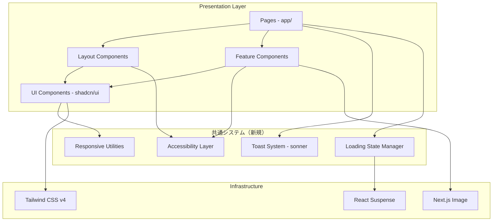
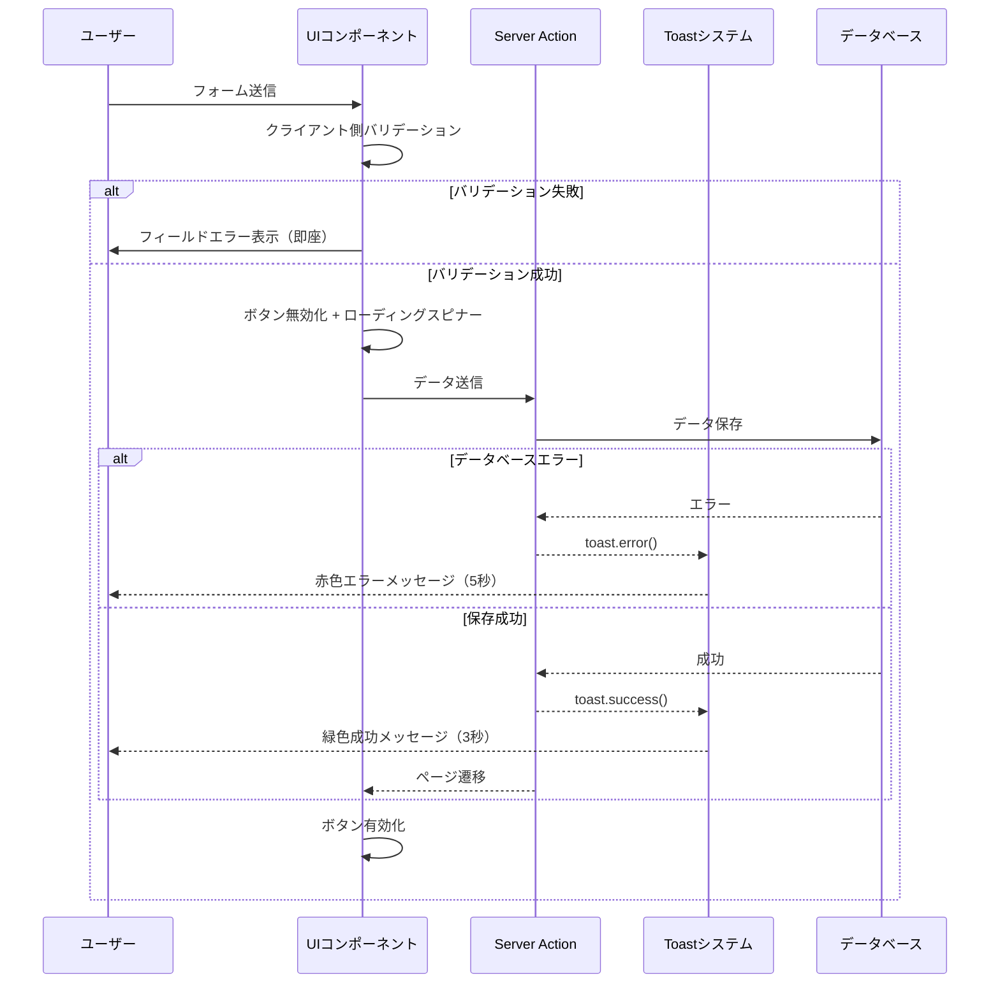
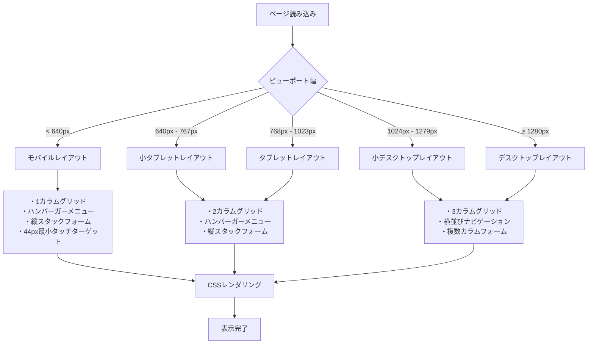
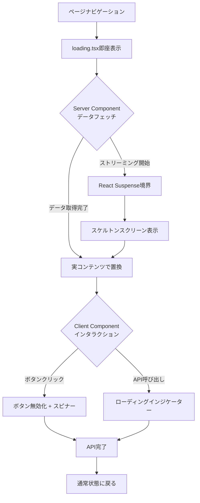
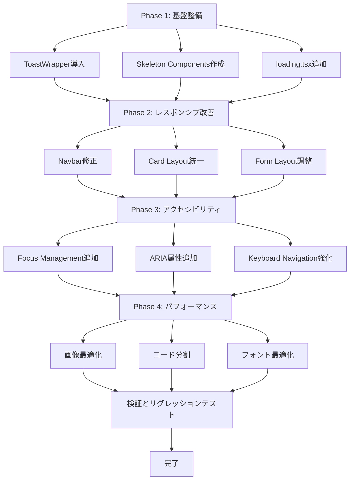

# Technical Design: UIUX包括的改善

## Overview

本プロジェクトは、既存のAIツール情報共有アプリケーションに対し、モバイルファーストのレスポンシブデザイン、明確なユーザーフィードバック、包括的なアクセシビリティ対応、パフォーマンス最適化を実現する包括的なUIUX改善を実施します。TKZとコボちゃんの2名のユーザーに、デバイスを問わず「ワクワクする」使いやすく快適な体験を提供することを目的としています。

### Goals

- **モバイルファーストのレスポンシブUI**: 320px〜2560px以上の全画面サイズで最適な表示と操作性を実現
- **明確なフィードバックシステム**: トースト通知、ローディング状態、バリデーションエラーを統一された方法で提供
- **WCAG 2.1 AA準拠のアクセシビリティ**: キーボードナビゲーション、スクリーンリーダー対応、ARIAの適切な実装
- **高速なパフォーマンス**: FCP 3秒以内、画像最適化、コード分割による初回読み込み時間の最小化
- **統一されたデザインシステム**: カード、ボタン、フォームの一貫性を保ち、保守性を向上

### Non-Goals

- ダークモードの実装（優先度：低、将来的な拡張として検討）
- 高度なアニメーション機能（優先度：低、基本的なトランジションのみ実装）
- デザインシステムの完全な再構築（既存shadcn/uiとTailwindベースを拡張）
- 新機能の追加（UIUX改善のみに焦点）

## Architecture

### 既存アーキテクチャの分析

**現在のアーキテクチャパターン**:
- Next.js 15 App Routerによるファイルベースルーティング
- Server ComponentsとClient Componentsの混在
- shadcn/ui + Radix UIによるコンポーネントライブラリ
- Tailwind CSS v4によるユーティリティファーストスタイリング
- sonnerライブラリによるトースト通知
- react-hook-form + zodによるフォーム管理

**保持すべき既存パターン**:
- コンポーネントの配置: `components/ui/`, `components/layout/`, `components/tools/`, `components/prompt/`
- ページ構造: `app/` ディレクトリのファイルベースルーティング
- スタイリングパターン: Tailwind CSS CSSカスタムプロパティ（`--background`, `--foreground`等）
- フォームバリデーション: Zodスキーマ + react-hook-form

**技術的負債への対応**:
- ローディング状態の統一（現在は個別コンポーネントで管理）
- アクセシビリティ属性の不足（ARIA、フォーカス管理）
- レスポンシブデザインの不一致（一部コンポーネントでモバイル最適化不足）

### High-Level Architecture



### Technology Alignment

本プロジェクトは既存システムへの拡張であるため、現在の技術スタックと完全に整合します。

**既存技術スタックの活用**:
- **Next.js 15**: App Router、React 19サポート、自動コード分割
- **Tailwind CSS v4**: モバイルファーストブレークポイント、CSSカスタムプロパティ、ダークモード対応
- **shadcn/ui + Radix UI**: アクセシブルなプリミティブ、カスタマイズ可能なコンポーネント
- **sonner**: トースト通知ライブラリ（既にインストール済み）
- **react-hook-form + zod**: フォーム管理とバリデーション

**新規導入ライブラリ**:
- なし（既存ライブラリのみで実装可能）

**既存パターンからの逸脱**:
- なし（既存のアーキテクチャと設計パターンを完全に踏襲）

### Key Design Decisions

#### Decision 1: Tailwind Breakpointsによるモバイルファーストレスポンシブ実装

**Context**:
要件1（レスポンシブデザインの最適化）において、320px〜2560px以上の全画面サイズでの最適な表示が求められています。現在、一部コンポーネントでモバイル最適化が不足しており、デスクトップ中心の設計になっています。

**Alternatives**:
1. **CSS Media Queries**: カスタムメディアクエリを直接使用
2. **Tailwind Breakpoints（モバイルファースト）**: sm:, md:, lg:, xl:, 2xl:プレフィックス【選択】
3. **Container Queries**: 要素ベースのレスポンシブ

**Selected Approach**:
Tailwind CSS v4のモバイルファーストブレークポイントシステムを使用します。

```typescript
// Tailwind breakpoints (mobile-first)
// デフォルト（unprefixed）: 0px〜（全画面サイズ）
// sm: 640px以上
// md: 768px以上
// lg: 1024px以上
// xl: 1280px以上
// 2xl: 1400px以上（tailwind.config.tsでカスタマイズ済み）

// 実装例: ナビゲーションメニュー
<nav className="flex flex-col md:flex-row gap-2 md:gap-6">
  // モバイル: flex-col（縦並び）
  // タブレット以上: flex-row（横並び）
</nav>

// 実装例: カードグリッド
<div className="grid grid-cols-1 md:grid-cols-2 lg:grid-cols-3 gap-4">
  // モバイル: 1列
  // タブレット: 2列
  // デスクトップ: 3列
</div>
```

**Rationale**:
- Tailwind CSS v4が既に導入済みで、追加ライブラリ不要
- モバイルファーストの設計思想に完全に一致（unprefixed = mobile）
- ビルド時にCSS生成され、ランタイムオーバーヘッドなし
- チームが既に慣れているパターン（学習コスト低）

**Trade-offs**:
- ✅ 獲得: 既存コードベースとの一貫性、追加依存なし、高速なビルド
- ❌ 犠牲: Container Queriesの柔軟性（今回は不要）

#### Decision 2: sonner + カスタムToastラッパーによる統一フィードバック

**Context**:
要件2（ユーザーフィードバックの明確化）において、成功・エラー・警告メッセージを統一された方法で表示する必要があります。現在、フィードバック表示が散在しており、一貫性がありません。

**Alternatives**:
1. **React Hot Toast**: 軽量なトースト通知ライブラリ
2. **sonner + カスタムラッパー**: 既存ライブラリを拡張【選択】
3. **shadcn/ui Toast**: shadcn/uiのToastコンポーネント（Radix UI Toast）

**Selected Approach**:
既にインストールされている`sonner`ライブラリをベースに、カスタムToastラッパーを作成します。

```typescript
// lib/toast.ts
import { toast as sonnerToast } from "sonner";

export const toast = {
  success: (message: string, options?: { duration?: number }) => {
    return sonnerToast.success(message, {
      duration: options?.duration ?? 3000,
      position: "top-center",
      style: {
        background: "hsl(var(--primary))",
        color: "hsl(var(--primary-foreground))",
      },
    });
  },

  error: (message: string, description?: string) => {
    return sonnerToast.error(message, {
      description,
      duration: 5000, // エラーは長めに表示
      position: "top-center",
      style: {
        background: "hsl(var(--destructive))",
        color: "hsl(var(--destructive-foreground))",
      },
    });
  },

  // ... warning, info等
};

// 使用例
toast.success("AIツールを登録しました");
toast.error("登録に失敗しました", "ネットワークエラーが発生しました");
```

**Rationale**:
- sonnerは既にpackage.jsonに存在し、app/layout.tsxで`<Toaster />`が配置済み
- 軽量（3KB gzipped）で、アクセシビリティ対応済み（ARIA live regions）
- 自動スタック管理、スワイプで削除、アニメーション標準装備
- カスタムラッパーで統一されたAPI提供、Tailwind CSS変数と統合

**Trade-offs**:
- ✅ 獲得: 追加インストール不要、既存設定を活用、一貫性のあるAPI
- ❌ 犠牲: shadcn/uiとの完全な統合（sonnerで十分なため問題なし）

#### Decision 3: React SuspenseとNext.js loading.tsxによるローディング状態管理

**Context**:
要件3（ローディング状態の可視化）において、データ読み込み中やAPI呼び出し中を明確に表示する必要があります。現在、ローディング状態が個別コンポーネントで管理されており、統一性がありません。

**Alternatives**:
1. **useState + useEffect**: 各コンポーネントで個別管理
2. **React Suspense + loading.tsx**: Next.js標準パターン【選択】
3. **グローバルローディング状態管理**: Zustand/Jotaiでグローバルステート

**Selected Approach**:
Next.js 15のApp Routerが提供する`loading.tsx`とReact Suspenseを組み合わせて、階層的なローディング状態を管理します。

```typescript
// app/tools/loading.tsx - ルートセグメント用
export default function ToolsLoading() {
  return (
    <div className="container mx-auto px-4 py-16">
      <div className="grid grid-cols-1 md:grid-cols-2 lg:grid-cols-3 gap-4">
        {Array.from({ length: 6 }).map((_, i) => (
          <SkeletonCard key={i} />
        ))}
      </div>
    </div>
  );
}

// components/ui/skeleton.tsx - スケルトンコンポーネント
export function SkeletonCard() {
  return (
    <div className="animate-pulse">
      <div className="h-32 bg-muted rounded-md" />
      <div className="mt-4 h-4 bg-muted rounded w-3/4" />
      <div className="mt-2 h-4 bg-muted rounded w-1/2" />
    </div>
  );
}

// app/tools/page.tsx - Suspense境界
export default async function ToolsPage() {
  return (
    <Suspense fallback={<SkeletonCard />}>
      <ToolsList />
    </Suspense>
  );
}
```

**Rationale**:
- Next.js 15がloading.tsxでのストリーミングとSuspenseを標準サポート
- Server ComponentsとClient Componentsの両方で一貫したパターン
- 階層的なローディング（ページレベル、セクションレベル、コンポーネントレベル）
- 自動的にFallback UIを表示、コード分割との統合

**Trade-offs**:
- ✅ 獲得: Next.js標準パターン、自動最適化、階層的な粒度
- ❌ 犠牲: グローバルローディングステート（ルートセグメント単位で十分）

## System Flows

### ユーザーフィードバックフロー



### レスポンシブレイアウト決定フロー



### ローディング状態管理フロー



## Requirements Traceability

| Requirement | 要件概要 | Components | Interfaces | Flows |
|-------------|----------|-----------|-----------|-------|
| 1.1-1.8 | レスポンシブデザイン最適化 | Navbar, ToolCard, ToolForm, 全ページレイアウト | Tailwind breakpoints (sm:, md:, lg:) | レスポンシブレイアウト決定フロー |
| 2.1-2.8 | ユーザーフィードバック明確化 | ToastWrapper, FormField, ConfirmDialog | toast.success(), toast.error(), FormMessage | ユーザーフィードバックフロー |
| 3.1-3.8 | ローディング状態可視化 | loading.tsx, Skeleton, LoadingSpinner, Button | React Suspense, isLoading props | ローディング状態管理フロー |
| 4.1-4.10 | フォーム入力UX向上 | Form, Input, Select, Textarea | react-hook-form, zod validation | ユーザーフィードバックフロー |
| 5.1-5.7 | カードレイアウト一貫性 | Card, ToolCard, PromptHistoryCard | CardHeader, CardContent, CardFooter | - |
| 6.1-6.8 | キーボードナビゲーション | 全インタラクティブ要素 | focus-visible, onKeyDown handlers | - |
| 7.1-7.8 | スクリーンリーダー対応 | 全コンポーネント | aria-label, role, aria-live | - |
| 8.1-8.8 | パフォーマンス最適化 | next/image, next/dynamic | Image, dynamic(), Suspense | - |

## Components and Interfaces

### Presentation Layer

#### ToastWrapper（新規）

**Responsibility & Boundaries**:
- **Primary Responsibility**: アプリケーション全体で統一されたトースト通知を提供
- **Domain Boundary**: UIフィードバック層
- **Data Ownership**: トースト表示状態とキュー管理

**Dependencies**:
- **Inbound**: 全ページ、Server Actions、Client Componentsからの通知リクエスト
- **Outbound**: sonnerライブラリ
- **External**: なし

**Contract Definition - Service Interface**:

```typescript
// lib/toast.ts
import { toast as sonnerToast, ExternalToast } from "sonner";

interface ToastOptions {
  duration?: number;
  dismissible?: boolean;
  description?: string;
}

export const toast = {
  /**
   * 成功メッセージを表示
   * @precondition message は空でない文字列
   * @postcondition 緑色のトーストが画面上部中央に3秒間表示される
   */
  success(message: string, options?: ToastOptions): string | number {
    return sonnerToast.success(message, {
      duration: options?.duration ?? 3000,
      position: "top-center",
      dismissible: options?.dismissible ?? true,
      description: options?.description,
      style: {
        background: "hsl(var(--primary))",
        color: "hsl(var(--primary-foreground))",
      },
    });
  },

  /**
   * エラーメッセージを表示
   * @precondition message は空でない文字列
   * @postcondition 赤色のトーストが画面上部中央に5秒間表示される
   */
  error(message: string, options?: ToastOptions): string | number {
    return sonnerToast.error(message, {
      duration: options?.duration ?? 5000,
      position: "top-center",
      dismissible: options?.dismissible ?? true,
      description: options?.description,
      style: {
        background: "hsl(var(--destructive))",
        color: "hsl(var(--destructive-foreground))",
      },
    });
  },

  /**
   * 警告メッセージを表示
   */
  warning(message: string, options?: ToastOptions): string | number {
    return sonnerToast.warning(message, {
      duration: options?.duration ?? 4000,
      position: "top-center",
      dismissible: options?.dismissible ?? true,
      description: options?.description,
    });
  },

  /**
   * 情報メッセージを表示
   */
  info(message: string, options?: ToastOptions): string | number {
    return sonnerToast.info(message, {
      duration: options?.duration ?? 3000,
      position: "top-center",
      dismissible: options?.dismissible ?? true,
      description: options?.description,
    });
  },
};
```

**Invariants**:
- 同時に表示されるトーストは最大5個まで（sonnerのデフォルト）
- 古いトーストから順に自動的に消える
- すべてのトーストは閉じるボタンを持つ

#### Skeleton Components（新規）

**Responsibility & Boundaries**:
- **Primary Responsibility**: データ読み込み中のスケルトンスクリーンを提供
- **Domain Boundary**: UIローディング層
- **Data Ownership**: なし（純粋なプレゼンテーション）

**Dependencies**:
- **Inbound**: loading.tsx、Suspense fallback
- **Outbound**: Tailwind CSS
- **External**: なし

**Contract Definition - Component Interface**:

```typescript
// components/ui/skeleton.tsx
interface SkeletonProps extends React.HTMLAttributes<HTMLDivElement> {
  className?: string;
}

/**
 * 基本スケルトン要素
 * @postcondition アニメーションするグレー背景を表示
 */
export function Skeleton({ className, ...props }: SkeletonProps): JSX.Element;

/**
 * カードスケルトン
 * @postcondition ToolCardの形状に一致するスケルトンを表示
 */
export function SkeletonCard(): JSX.Element;

/**
 * フォームスケルトン
 * @postcondition フォームレイアウトに一致するスケルトンを表示
 */
export function SkeletonForm(): JSX.Element;

/**
 * テーブルスケルトン
 * @param rows 表示する行数
 */
export function SkeletonTable({ rows }: { rows: number }): JSX.Element;
```

#### Enhanced Form Components（既存拡張）

**Responsibility & Boundaries**:
- **Primary Responsibility**: アクセシブルで使いやすいフォーム入力を提供
- **Domain Boundary**: フォームUI層
- **Data Ownership**: フォーム入力状態、バリデーションエラー

**Dependencies**:
- **Inbound**: ToolForm, LoginForm等のフィーチャーコンポーネント
- **Outbound**: react-hook-form, zod, Radix UI
- **External**: なし

**Integration Strategy**:
- **Modification Approach**: 既存コンポーネントを拡張（破壊的変更なし）
- **Backward Compatibility**: 既存のForm, Input, Select, Textareaは完全互換を維持
- **Migration Path**: 新規プロパティを追加し、既存コードは段階的に更新

**Contract Definition - Component Interface**:

```typescript
// components/ui/input.tsx（拡張版）
export interface InputProps extends React.InputHTMLAttributes<HTMLInputElement> {
  /**
   * 文字数制限（カウンター表示用）
   */
  maxLength?: number;
  /**
   * 文字数カウンター表示
   */
  showCounter?: boolean;
  /**
   * 入力例テキスト
   */
  helperText?: string;
  /**
   * エラー状態
   */
  error?: boolean;
  /**
   * エラーメッセージ
   */
  errorMessage?: string;
}

// components/ui/select.tsx（拡張版）
export interface SelectProps {
  /**
   * 検索可能なドロップダウン
   */
  searchable?: boolean;
  /**
   * オートコンプリート機能
   */
  autoComplete?: boolean;
}
```

**State Management**:
- **State Model**: react-hook-formによる制御コンポーネント
- **Persistence**: フォームステートはコンポーネントレベル、データはServer Actionsでサーバー送信
- **Concurrency**: なし（単一ユーザー操作）

### Loading State Layer

#### Loading Files（新規）

**Responsibility & Boundaries**:
- **Primary Responsibility**: ルートセグメント単位でのローディングUIを提供
- **Domain Boundary**: ページレベルローディング層
- **Data Ownership**: なし（純粋なUI）

**Dependencies**:
- **Inbound**: Next.js App Router
- **Outbound**: Skeleton components
- **External**: なし

**Contract Definition - File-based Interface**:

```typescript
// app/tools/loading.tsx
/**
 * ツール一覧ページのローディングUI
 * @postcondition スケルトンカードを6個表示
 */
export default function ToolsLoading(): JSX.Element;

// app/prompt/loading.tsx
/**
 * プロンプト生成ページのローディングUI
 * @postcondition フォームスケルトンを表示
 */
export default function PromptLoading(): JSX.Element;

// app/history/loading.tsx
/**
 * 履歴ページのローディングUI
 * @postcondition テーブルスケルトンを表示
 */
export default function HistoryLoading(): JSX.Element;
```

### Accessibility Layer

#### Focus Management Utilities（新規）

**Responsibility & Boundaries**:
- **Primary Responsibility**: フォーカストラップ、フォーカス復元、フォーカス可視化を提供
- **Domain Boundary**: アクセシビリティ層
- **Data Ownership**: フォーカス状態

**Dependencies**:
- **Inbound**: モーダル、ドロップダウン、ダイアログコンポーネント
- **Outbound**: DOM API
- **External**: なし

**Contract Definition - Hook Interface**:

```typescript
// lib/hooks/use-focus-trap.ts
/**
 * モーダル内でフォーカスをトラップ
 * @precondition モーダルが開いている
 * @postcondition Tabキーでフォーカスがモーダル内を循環
 * @postcondition Escキーでモーダルを閉じる
 */
export function useFocusTrap(
  isOpen: boolean,
  onClose: () => void
): React.RefObject<HTMLDivElement>;

// lib/hooks/use-focus-restoration.ts
/**
 * モーダルを閉じた際に元の要素にフォーカスを戻す
 * @precondition モーダルが開く前のフォーカス要素を記憶
 * @postcondition モーダルが閉じた後、元の要素にフォーカスを復元
 */
export function useFocusRestoration(isOpen: boolean): void;

// lib/utils/focus.ts
/**
 * 最初のエラーフィールドにフォーカスとスクロール
 * @param formRef フォーム要素のref
 */
export function focusFirstError(formRef: React.RefObject<HTMLFormElement>): void;
```

#### ARIA Announcer（新規）

**Responsibility & Boundaries**:
- **Primary Responsibility**: スクリーンリーダー用の動的アナウンスを管理
- **Domain Boundary**: アクセシビリティ層
- **Data Ownership**: aria-liveリージョンのメッセージキュー

**Dependencies**:
- **Inbound**: トースト通知、フォームバリデーション、データ更新
- **Outbound**: DOM（aria-liveリージョン）
- **External**: なし

**Contract Definition - Service Interface**:

```typescript
// lib/aria-announcer.ts
type AnnouncePriority = "polite" | "assertive";

/**
 * スクリーンリーダーにメッセージをアナウンス
 * @param message アナウンスするメッセージ
 * @param priority "polite"（通常）または "assertive"（緊急）
 * @postcondition aria-liveリージョンにメッセージを追加
 */
export function announce(
  message: string,
  priority?: AnnouncePriority
): void;

// app/layout.tsx に追加
<div role="status" aria-live="polite" aria-atomic="true" className="sr-only" />
<div role="alert" aria-live="assertive" aria-atomic="true" className="sr-only" />
```

**Event Contract**:
- **Published Events**: なし
- **Subscribed Events**: トースト表示、バリデーションエラー、データ更新
- **Delivery**: 同期的にaria-liveリージョンを更新

### Responsive Utilities

#### Breakpoint Hooks（新規）

**Responsibility & Boundaries**:
- **Primary Responsibility**: JavaScriptでブレークポイント判定が必要な場合のユーティリティ
- **Domain Boundary**: レスポンシブユーティリティ層
- **Data Ownership**: 現在のブレークポイント状態

**Dependencies**:
- **Inbound**: Client Componentsでの条件付きレンダリング
- **Outbound**: window.matchMedia API
- **External**: なし

**Contract Definition - Hook Interface**:

```typescript
// lib/hooks/use-media-query.ts
/**
 * メディアクエリの状態を監視
 * @param query CSSメディアクエリ文字列
 * @returns マッチするかどうか
 * @postcondition ウィンドウリサイズ時に再評価
 */
export function useMediaQuery(query: string): boolean;

// 使用例
const isMobile = useMediaQuery("(max-width: 767px)");
const isDesktop = useMediaQuery("(min-width: 1024px)");
```

**State Management**:
- **State Model**: useState + useEffect + matchMedia listener
- **Persistence**: なし（ブラウザのビューポートサイズに依存）
- **Concurrency**: ウィンドウリサイズイベントはdebounce（16ms、1フレーム）

## Data Models

本プロジェクトはUIUX改善であるため、新規データモデルは導入しません。既存のデータモデル（AITool、PromptHistory等）は変更なく使用します。

### UI State Models

#### Toast State

```typescript
// sonnerが内部管理（外部公開なし）
interface ToastState {
  id: string | number;
  message: string;
  type: "success" | "error" | "warning" | "info";
  duration: number;
  visible: boolean;
  description?: string;
}
```

#### Loading State

```typescript
// React Suspenseが内部管理
// コンポーネントレベルでのisLoadingフラグ
interface ButtonLoadingState {
  isLoading: boolean;
}

interface FormLoadingState {
  isSubmitting: boolean;
}
```

#### Focus State

```typescript
// フォーカス管理フック
interface FocusState {
  previousActiveElement: Element | null;
  isTrapped: boolean;
}
```

## Error Handling

### Error Strategy

本プロジェクトでは、ユーザーエラー、システムエラー、バリデーションエラーを明確に区別し、それぞれに適したフィードバックを提供します。

### Error Categories and Responses

#### User Errors（4xx相当）

**Invalid Input（バリデーションエラー）**:
- **検出タイミング**: フィールドフォーカス離脱時（onBlur）、フォーム送信時
- **表示方法**: フィールド直下に赤文字エラーメッセージ、赤枠ボーダー
- **ユーザーガイダンス**: 「ツール名は必須です」「メールアドレスの形式が正しくありません」等の具体的なメッセージ

```typescript
// Zodスキーマによるバリデーション
const toolSchema = z.object({
  tool_name: z.string().min(1, "ツール名は必須です"),
  category: z.string().min(1, "カテゴリを選択してください"),
  rating: z.number().min(1).max(5, "評価は1〜5の範囲で選択してください"),
});

// FormMessageコンポーネントで表示
<FormMessage aria-live="polite" />
```

**Unauthorized（未認証）**:
- **検出タイミング**: Server Action実行時、ページ読み込み時
- **表示方法**: トースト通知 + ログインページへリダイレクト
- **ユーザーガイダンス**: 「ログインが必要です」

**Not Found（404）**:
- **検出タイミング**: データ取得時
- **表示方法**: ページ内に「見つかりません」メッセージ
- **ユーザーガイダンス**: 「指定されたツールが見つかりませんでした」+ 一覧へのリンク

#### System Errors（5xx相当）

**Infrastructure Failures（データベース接続エラー等）**:
- **検出タイミング**: Server Action実行時
- **表示方法**: 赤色トースト通知（5秒間）
- **ユーザーガイダンス**: 「一時的なエラーが発生しました。しばらくしてから再度お試しください」
- **グレースフルデグラデーション**: データが取得できない場合、空状態UIを表示

**Timeouts（タイムアウト）**:
- **検出タイミング**: API呼び出しが10秒以上応答なし
- **表示方法**: トースト通知
- **ユーザーガイダンス**: 「サーバーの応答が遅れています。再度お試しください」

#### Business Logic Errors（422相当）

**Rule Violations（ビジネスルール違反）**:
- **検出タイミング**: Server Action内のビジネスロジック検証
- **表示方法**: トースト通知（警告色）
- **ユーザーガイダンス**: 「このツールは既に登録されています」等の具体的な理由

### Monitoring

**Error Tracking**:
- コンソールエラーログ（開発環境）
- 将来的にSentryやDatadog等の導入を検討（現時点では実装しない）

**Logging**:
```typescript
// lib/logger.ts（簡易版）
export const logger = {
  error: (message: string, error: Error) => {
    if (process.env.NODE_ENV === "development") {
      console.error(message, error);
    }
    // 本番環境では外部サービスに送信（将来）
  },
};
```

**Health Monitoring**:
- 既存の`/api/health`エンドポイントを活用
- ローディング時間の測定（Web Vitals）

## Testing Strategy

### Unit Tests

**優先度の高いコンポーネント**:
1. **ToastWrapper（lib/toast.ts）**:
   - `toast.success()`が正しい色とdurationで表示される
   - `toast.error()`が長めのdurationで表示される
   - 同時に複数のトーストが表示される場合のスタック動作

2. **Skeleton Components**:
   - `SkeletonCard`が正しいクラス名でレンダリングされる
   - `SkeletonForm`がアニメーションを持つ

3. **Focus Management Hooks**:
   - `useFocusTrap`がモーダル内でフォーカスを循環させる
   - `useFocusRestoration`がモーダル閉時に元の要素にフォーカスを戻す
   - `focusFirstError`が最初のエラーフィールドにスクロールする

4. **ARIA Announcer**:
   - `announce()`がaria-liveリージョンにメッセージを追加する
   - "assertive"優先度が即座にアナウンスされる

5. **Breakpoint Hooks**:
   - `useMediaQuery`がウィンドウリサイズ時に再評価される
   - デバウンス処理が正しく動作する

### Integration Tests

**クロスコンポーネントフロー**:
1. **フォーム送信 → バリデーション → トースト表示**:
   - 無効なデータ送信時にフィールドエラーが表示される
   - 有効なデータ送信時に成功トーストが表示される
   - 送信中にボタンが無効化される

2. **ページナビゲーション → loading.tsx → データ表示**:
   - ページ遷移時にloading.tsxが即座表示される
   - データ取得完了後にスケルトンが実コンテンツに置換される

3. **モーダル開閉 → フォーカス管理**:
   - モーダルを開くとフォーカスがモーダル内に移動する
   - Escキーでモーダルが閉じ、元の要素にフォーカスが戻る

4. **レスポンシブレイアウト切り替え**:
   - ビューポート幅変更時にナビゲーションメニューが切り替わる
   - カードグリッドが1列 → 2列 → 3列に変化する

5. **アクセシビリティフロー（キーボードナビゲーション）**:
   - Tabキーで論理的な順序でフォーカスが移動する
   - Enterキーでボタンがアクティベートされる

### E2E/UI Tests

**重要なユーザーパス**:
1. **AIツール登録フロー（モバイル）**:
   - モバイルビューポートでツール登録ページにアクセス
   - フォームに入力（1カラムレイアウト確認）
   - 送信ボタンクリック → ローディングスピナー確認
   - 成功トースト表示確認 → 一覧ページへ遷移

2. **ツール一覧閲覧（タブレット）**:
   - タブレットビューポートでツール一覧にアクセス
   - スケルトンカード表示確認
   - 2カラムグリッド表示確認
   - カードホバー時の視覚的フィードバック確認

3. **キーボードのみでのナビゲーション（デスクトップ）**:
   - Tabキーでナビゲーションメニューを移動
   - Enterキーで「AIツール」ページに遷移
   - Tabキーでカード内のボタンにフォーカス
   - Enterキーで詳細ページへ遷移

4. **エラーハンドリング（全デバイス）**:
   - 無効なデータでフォーム送信
   - フィールドエラー表示確認
   - 最初のエラーフィールドにフォーカス確認
   - スクリーンリーダーでエラー読み上げ確認

5. **画像最適化とローディング（モバイル）**:
   - 遅いネットワーク条件でページ読み込み
   - 画像の遅延読み込み確認
   - WebP形式配信確認
   - FCP 3秒以内を確認

### Performance/Load Tests

**パフォーマンス指標**:
1. **First Contentful Paint（FCP）**:
   - 目標: 3秒以内
   - 測定: Lighthouse、Web Vitals

2. **Largest Contentful Paint（LCP）**:
   - 目標: 2.5秒以内
   - 測定: Lighthouse

3. **Cumulative Layout Shift（CLS）**:
   - 目標: 0.1以下
   - 測定: next/imageのwidth/height属性によるレイアウトシフト防止

4. **Time to Interactive（TTI）**:
   - 目標: 5秒以内
   - 測定: コード分割による初回バンドルサイズ削減

## Security Considerations

### 認証と認可

**既存の認証フローを維持**:
- Google OAuthによる認証（NextAuth.js v5）
- セッションベースの認可
- サーバーサイドでの認証状態チェック

**UIUX改善における追加対策**:
- ログアウト時の明確な視覚的フィードバック（トースト通知）
- 未認証ユーザーへのリダイレクト前のメッセージ表示

### データ保護

**XSS対策**:
- Reactの自動エスケープ機能を活用
- `dangerouslySetInnerHTML`の使用を避ける

**CSRF対策**:
- Next.js Server Actionsの組み込みCSRF保護を活用

### アクセシビリティとセキュリティ

**フォーカス管理のセキュリティリスク**:
- モーダルを閉じた際のフォーカス復元で、削除された要素にフォーカスしないよう防御的プログラミング

**スクリーンリーダー情報漏洩防止**:
- aria-liveリージョンに機密情報を含めない
- エラーメッセージは一般的な表現を使用

## Performance & Scalability

### Target Metrics

| Metric | Target | Measurement |
|--------|--------|-------------|
| First Contentful Paint (FCP) | < 3秒 | Lighthouse, Web Vitals |
| Largest Contentful Paint (LCP) | < 2.5秒 | Lighthouse, Web Vitals |
| Cumulative Layout Shift (CLS) | < 0.1 | Lighthouse, Web Vitals |
| Time to Interactive (TTI) | < 5秒 | Lighthouse |
| 初回JavaScriptバンドルサイズ | < 200KB gzipped | next build --analyze |
| 画像サイズ | 最適化（WebP/AVIF） | next/image automatic |

### Scaling Approaches

**水平スケーリング**:
- Vercel Edge Networkによる自動スケーリング（既存）
- 静的ファイル（画像、CSS、JS）のCDN配信

**垂直スケーリング**:
- 不要（フロントエンド改善のみ、バックエンド負荷変化なし）

### Caching Strategies

**ブラウザキャッシュ**:
- Next.js自動最適化による静的アセットの長期キャッシュ（_next/static/）
- 画像: next/imageによる自動キャッシュヘッダー

**Service Worker**:
- 現時点では実装しない（将来的にPWA対応時に検討）

### Optimization Techniques

**画像最適化**:
```typescript
// next/imageの活用
import Image from "next/image";

<Image
  src="/tool-image.png"
  alt="AIツールのスクリーンショット"
  width={400}
  height={300}
  loading="lazy"
  sizes="(max-width: 768px) 100vw, (max-width: 1200px) 50vw, 33vw"
/>
```

**コード分割**:
```typescript
// next/dynamicによる動的インポート
import dynamic from "next/dynamic";

const PromptGenerator = dynamic(
  () => import("@/components/prompt/prompt-generator"),
  {
    loading: () => <SkeletonForm />,
    ssr: false, // クライアント専用コンポーネント
  }
);
```

**フォント最適化**:
```typescript
// app/layout.tsx
import { Inter } from "next/font/google";

const inter = Inter({
  subsets: ["latin"],
  display: "swap", // FOIT（Flash of Invisible Text）防止
  variable: "--font-sans",
});
```

**CSS最適化**:
- Tailwind CSS v4のJIT（Just-In-Time）コンパイル
- 未使用CSSの自動削除（PurgeCSS）
- CSSカスタムプロパティによるダークモード準備（実装は将来）

**JavaScript最適化**:
- Server Componentsをデフォルト使用（クライアントJavaScript削減）
- "use client"は必要最小限のコンポーネントのみ
- React 19のコンパイラ最適化を活用

## Migration Strategy

本プロジェクトは既存システムへの段階的拡張であるため、破壊的変更を避け、段階的に改善を適用します。



### Phase 1: 基盤整備（2-3日）

**作業内容**:
- ToastWrapper（lib/toast.ts）作成
- Skeleton Components（components/ui/skeleton.tsx）作成
- loading.tsx（app/tools/loading.tsx等）追加

**ロールバックトリガー**:
- トースト表示が既存実装と競合
- スケルトンスクリーンでレイアウトシフト発生

**検証チェックポイント**:
- ✅ トースト通知が正しく表示される
- ✅ loading.tsxが即座に表示される
- ✅ 既存ページの動作に影響なし

### Phase 2: レスポンシブ改善（3-4日）

**作業内容**:
- Navbar、ToolCard、ToolForm等にTailwind breakpoints適用
- モバイル・タブレット・デスクトップでの表示確認

**ロールバックトリガー**:
- 特定ブレークポイントでレイアウト崩れ
- タッチターゲットサイズ不足

**検証チェックポイント**:
- ✅ 320px、768px、1024px、1440pxで正しく表示
- ✅ タッチターゲット44px以上確保

### Phase 3: アクセシビリティ（3-4日）

**作業内容**:
- Focus Management hooks追加
- ARIA属性追加（aria-label, role, aria-live）
- キーボードナビゲーション強化

**ロールバックトリガー**:
- スクリーンリーダーで正しく読み上げられない
- フォーカストラップが機能しない

**検証チェックポイント**:
- ✅ NVDAでページを読み上げテスト
- ✅ キーボードのみで全操作可能

### Phase 4: パフォーマンス最適化（2-3日）

**作業内容**:
- next/imageへの移行
- next/dynamicでコード分割
- フォント最適化（font-display: swap）

**ロールバックトリガー**:
- FCP/LCPが目標値を超える
- 画像表示でCLS発生

**検証チェックポイント**:
- ✅ Lighthouse スコア90以上
- ✅ FCP < 3秒、CLS < 0.1

---

**作成日**: 2025-10-22
**言語**: 日本語
**バージョン**: 1.0
**次のステップ**: タスク生成（`/kiro:spec-tasks uiux-comprehensive-improvements -y`）
